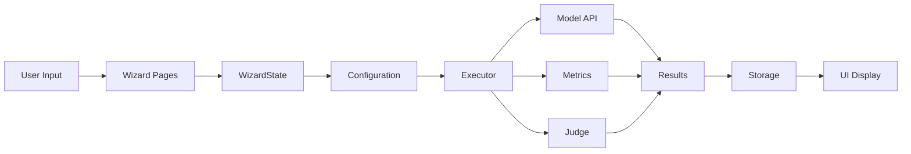

# AI Evaluation Wizard Master Plan
*Comprehensive Technical Implementation Guide - Complete Edition*
*Last Updated: June 16, 2025*

## 📖 Executive Summary & Project Context

### What is AI Dev Gallery?

AI Dev Gallery is Microsoft's open-source desktop application that democratizes access to AI development tools. Built on WinUI 3 and running entirely locally on Windows devices, it provides a curated collection of AI models, samples, and development tools without requiring cloud connectivity or deep ML expertise.

**Core Features of AI Dev Gallery:**
- **Model Library**: Pre-configured access to state-of-the-art models (GPT-4o, Phi-4, Llama, Stable Diffusion, etc.)
- **Sample Showcase**: Ready-to-run examples demonstrating AI capabilities across domains
- **API Integration**: Simplified setup for OpenAI, Azure AI, Anthropic, and local models
- **Privacy-First**: All processing happens locally, data never leaves the device
- **Developer-Friendly**: Extensible architecture for adding new models and samples

### Why Build an Evaluation Wizard?

As AI adoption accelerates, a critical gap has emerged: **domain experts need to evaluate AI performance without becoming ML engineers**. Current solutions fall into two extremes:

1. **Enterprise Platforms** (Azure AI Foundry, Weights & Biases, ML Flow)
   - Powerful but complex
   - Require cloud infrastructure
   - Steep learning curve
   - Expensive for small teams

2. **Developer Tools** (HuggingFace Evaluate, OpenAI Evals)
   - Command-line interfaces
   - Require coding skills
   - Limited visualization
   - Fragmented ecosystem

**Our Solution**: The AI Evaluation Wizard bridges this gap by providing:
- **Visual Configuration**: Step-by-step wizard interface
- **No-Code Evaluation**: Domain experts can evaluate without writing code
- **Flexible Workflows**: Support for different evaluation scenarios
- **Local Execution**: Privacy-preserving, runs entirely on-device
- **Modern Models**: Native support for GPT-4o, Phi-4, Azure AI Vision
- **Robust Metrics**: Both automated metrics and AI-based judgment

### Project Motivation & Goals

**Primary Motivation**: Enable non-technical users to answer the critical question: *"How well does this AI model perform on my specific use case?"*

**Target Users**:
- Product managers evaluating AI features
- Content creators testing generation quality
- Business analysts measuring AI accuracy
- Researchers comparing model performance
- Anyone needing AI evaluation without ML expertise

**Design Principles**:
1. **Accessibility First**: Every feature must be usable without coding
2. **Progressive Disclosure**: Simple defaults with advanced options
3. **Error Prevention**: Guide users away from common mistakes
4. **Local-First**: No mandatory cloud dependencies
5. **Extensible**: Easy to add new models and metrics

### Technical Foundation

The Evaluation Wizard is built on top of AI Dev Gallery's existing infrastructure:

**Leveraged Components**:
- **AppData Service**: Persistent storage for configurations and results
- **Model Management**: Existing model download and configuration system
- **Credential Manager**: Secure API key storage
- **UI Framework**: WinUI 3 patterns and controls
- **Navigation System**: Page-based navigation with state management

**New Components Built**:
- **Wizard Framework**: Multi-step configuration with validation
- **Evaluation Engine**: Orchestrates model execution and metric calculation
- **Dataset Management**: JSONL parsing and image handling
- **Results Storage**: Database schema for evaluation outcomes
- **Progress Tracking**: Real-time updates during long-running evaluations

### Current Development Status

We're building this feature incrementally on the `feature/evaluation-wizard` branch. The UI framework is complete and functional, allowing users to configure evaluations through a 6-step wizard. The critical missing piece is the execution engine that actually runs the configured evaluations.

**Completed**:
- Full wizard UI (all 6 steps)
- Data validation and error handling
- State persistence across navigation
- Dataset upload with size limits
- Configuration review and editing

**In Progress**:
- Execution pipeline implementation
- API client integration
- Progress tracking system
- Results storage and display

This master plan documents both the completed work and the roadmap for finishing the evaluation system.

### Integration with Windows Ecosystem

The Evaluation Wizard leverages Windows-specific technologies for optimal performance and security:

**Windows Integration Points**:
- **Windows Credential Manager**: Secure storage of API keys using Windows DPAPI encryption
- **WinUI 3**: Native Windows 11 look and feel with Fluent Design System
- **Windows App SDK**: Modern app lifecycle and windowing
- **File System Integration**: Native file pickers and drag-drop support
- **Windows ML**: Future integration for local model execution

**Privacy & Security Architecture**:
- All data processing happens locally - no telemetry or cloud uploads
- API keys stored in Windows Credential Manager, never in plain text
- Dataset files remain on local disk, only paths are stored
- Results stored in local SQLite database
- No network calls except to configured AI model endpoints

### Architectural Decisions & Rationale

**Why a Wizard Pattern?**
- **Reduces Cognitive Load**: Breaking complex configuration into discrete steps
- **Progressive Disclosure**: Show only relevant options based on previous choices
- **Error Prevention**: Validate each step before proceeding
- **Familiar Pattern**: Windows users expect wizards for complex setup tasks

**Why Three Workflows?**
1. **Test Model**: Complete end-to-end evaluation (most common use case)
2. **Evaluate Responses**: For users who already have model outputs
3. **Import Results**: For comparing evaluations across teams/time

**Why Local-First?**
- **Privacy**: Many organizations can't upload data to cloud services
- **Performance**: No network latency for large image datasets
- **Cost**: No cloud storage or compute charges
- **Control**: Users own their data and results completely

**Why 1000 Item Limit?**
- **UX Responsiveness**: Larger datasets cause UI freezing
- **Memory Constraints**: Images loaded for preview/validation
- **Execution Time**: Keeps evaluation under 1 hour for better UX
- **Future**: Batch processing planned for larger datasets

### Development Philosophy

**Incremental Delivery**:
We're shipping the wizard UI first, then the execution engine. This allows:
- Early user feedback on the configuration experience
- Parallel development of UI and backend
- Reduced risk through smaller deployments
- Ability to refine UX before expensive backend work

**Code Quality Standards**:
- Follow existing AI Dev Gallery patterns
- Use established controls and styles
- Comprehensive error handling
- Accessibility from day one
- Unit tests for business logic
- Integration tests for workflows

### Technical Stack & Dependencies

**Core Technologies**:
- **Language**: C# 12 with .NET 8
- **UI Framework**: WinUI 3 (Windows App SDK 1.5)
- **Data Storage**: SQLite via Entity Framework Core
- **JSON Parsing**: System.Text.Json
- **Async Operations**: Task-based asynchronous pattern (TAP)
- **Dependency Injection**: Microsoft.Extensions.DependencyInjection

**External Dependencies**:
- **AI Model APIs**: OpenAI, Azure OpenAI, Anthropic SDKs
- **Image Processing**: Windows.Graphics.Imaging
- **File Operations**: Windows.Storage APIs
- **Security**: Windows.Security.Credentials

**Development Tools**:
- **IDE**: Visual Studio 2022 or VS Code with C# Dev Kit
- **Version Control**: Git with feature branch workflow
- **Code Analysis**: StyleCop Analyzers
- **Testing**: MSTest with WinUI test helpers

### Getting Started for New Contributors

**Prerequisites**:
1. Windows 11 (Build 22000 or higher)
2. Visual Studio 2022 with Windows App SDK workload
3. Git for version control
4. Access to AI Dev Gallery repository

**Setup Steps**:
1. Clone the repository: `git clone [repo-url]`
2. Checkout feature branch: `git checkout feature/evaluation-wizard`
3. Restore NuGet packages: `dotnet restore`
4. Build solution: `dotnet build`
5. Run app: Launch from Visual Studio or `dotnet run`

**Key Files to Understand**:
- `/AIDevGallery/Pages/Evaluate/` - All wizard pages
- `/AIDevGallery/Models/EvaluationConfiguration.cs` - Core data model
- `/AIDevGallery/Controls/WizardDialog.xaml` - Wizard container
- `/AIDevGallery/Utils/AppData.cs` - Storage service
- `EVALUATION-WIZARD-MASTER-PLAN.md` - This document
- `EVALUATION-WIZARD-TODOS.md` - Task tracking

---

## 🎯 Quick Status Summary (Updated June 17, 2025)

### What We Fixed Today (All TESTED ✅)
1. **Start Evaluation Button** - Now properly validates and enables based on workflow requirements
2. **Evaluation Creation** - Creates entries in list with appropriate status
3. **Import Status** - Shows "Imported" with 100% progress for workflow 3

### Previously Fixed (June 16, 2025)
1. **Dialog Positioning** - Wizard now centers properly, maintains consistent width
2. **Dataset Size Limit** - Hard refusal for > 1000 items with inline error panel
3. **State Persistence** - Back button now preserves all user input
4. **Build Errors** - Fixed all control name mismatches and missing imports

### What's Working
- Complete 6-step wizard flow (Workflow 1 fully tested)
- All UI pages functional with proper validation
- Start Evaluation button creates entries in list
- Different status for imported vs pending evaluations
- Data collection and validation
- Navigation with state preservation
- Dataset upload (JSONL and image folders)
- Metrics selection with custom criteria
- Configuration review with edit capabilities
- Evaluations saved to AppData for persistence

### What's NOT Working (Critical Gap)
- **No execution pipeline** - The wizard creates a configuration but can't run it
- **No API integration** - Can't actually call GPT-4o, Phi-4, or Azure AI Vision
- **No progress tracking** - No way to show evaluation progress
- **No results storage** - Nowhere to save evaluation outputs

### Next Steps Priority
1. Build execution infrastructure (EvaluationExecutor service)
2. Implement API clients for each model
3. Add progress tracking and status updates
4. Create results storage system

## 📝 Lessons Learned from Today's Fixes

### WinUI Dialog Behavior
- **Never set fixed dimensions on ContentDialog** - It breaks automatic centering
- Content-based sizing should be on the inner Grid, not the dialog itself
- WinUI handles dialog positioning automatically when no constraints are set

### Navigation State Management
- **Always pass state objects during navigation** - Both forward AND backward
- Create a central state object at dialog creation, not per-page
- OnNavigatedTo/OnNavigatingFrom pattern is essential for state persistence
- Control names in .cs files MUST match x:Name in XAML exactly

### Error Handling Patterns
- **Nested ContentDialogs are not allowed** - Use inline panels instead
- Hard refusal is better than dismissible warnings for critical limits
- Show errors immediately after validation, not after processing

### Code Quality
- Always check for control name mismatches between XAML and code-behind
- Use culture-invariant string operations (ToUpperInvariant)
- Follow StyleCop rules (constants before fields)
- Replace empty string literals with string.Empty

## Table of Contents
1. [Executive Summary & Project Context](#executive-summary--project-context)
2. [Quick Status Summary](#quick-status-summary)
3. [Lessons Learned](#lessons-learned-from-todays-fixes)
4. [Overview & Vision](#overview--vision)
5. [Current Critical Issues](#current-critical-issues)
6. [Three-Workflow Architecture](#three-workflow-architecture)
7. [Evaluation Methodology & ML Context](#evaluation-methodology--ml-context)
8. [Implementation Status](#implementation-status)
9. [Immediate Fix Plan](#immediate-fix-plan)
10. [Complete Feature Specifications](#complete-feature-specifications)
11. [Technical Architecture](#technical-architecture)
12. [Data Models & Storage](#data-models--storage)
13. [UI/UX Specifications](#uiux-specifications)
14. [Execution Pipeline](#execution-pipeline)
15. [Testing & Quality](#testing--quality)
16. [Future Enhancements](#future-enhancements)
17. [Project Roadmap & Timeline](#project-roadmap--timeline)

## Overview & Vision

Create the first AI evaluation tool designed for domain experts with privacy-first, desktop-native architecture. Bridge the gap between enterprise complexity (Azure AI Foundry, W&B) and developer-only tools (HuggingFace, OpenAI Evals).

**Market Position**: Serve domain experts who need powerful evaluation without ML engineering expertise.

**Core Value Propositions**:
- Visual wizard-driven evaluation setup
- Support for latest models (GPT-4o, Phi-4, Azure AI Vision)
- Robust local file handling with privacy-first architecture
- Three distinct workflows for different evaluation needs
- No cloud dependencies - everything runs locally

## Current Critical Issues

### 1. Dialog Positioning & Sizing ❌
**Problem**: Dialog appears left-aligned instead of centered, width changes when InfoBar dismissed
**Root Cause**: Fixed Width="700" on ContentDialog breaks WinUI positioning
**Solution**: Remove fixed sizing from dialog, use content-based sizing
```xml
<!-- REMOVE from WizardDialog.xaml -->
Width="700" MaxWidth="700" MinHeight="500"

<!-- ADD to page content -->
<Grid MinWidth="650" MaxWidth="800">
```

### 2. Dataset Warning Not Showing ❌
**Problem**: No warning appears for datasets > 1000 items
**Debug**: Added logging shows ExceedsLimit=true but dialog doesn't display
**Solution**: Show warning immediately after file selection
```csharp
// In ProcessJsonlFile/ProcessFolder - BEFORE validation
if (lineCount > MaxDatasetSize)
{
    var shouldContinue = await ShowDatasetLimitWarningAsync();
    if (!shouldContinue) return;
}
```

### 3. Start Evaluation Button Disabled ❌
**Problem**: Cannot proceed from ReviewConfigurationPage
**Debug Needed**: Check IsReadyToExecute property
**Solution**: Add logging and verify all required data present

### 4. State Loss on Navigation ❌
**Problem**: All data lost when using back/edit buttons
**Status**: State object created, edit buttons pass state, but pages don't receive it
**Solution**: Implement OnNavigatedTo in all pages

## Three-Workflow Architecture

### Workflow 1: Test Model (Generate + Evaluate)
**User Scenario**: "I want to test my AI model on a dataset and measure quality"
**Process**: Dataset → Model → Responses → Evaluation → Results
**Steps**: 6 total
1. Choose Evaluation Type (Image Description Quality)
2. Choose Your Workflow (Test Model)
3. Model Configuration (API setup)
4. Dataset Upload (images + prompts)
5. Metrics Selection (automated + AI judge)
6. Review & Execute

**Technical Flow**:
1. User provides dataset (local images + prompts)
2. System generates responses using configured model
3. LLM judge evaluates responses against criteria
4. Results aggregated and visualized

### Workflow 2: Evaluate Responses (Evaluate Only)
**User Scenario**: "I have AI-generated responses and want to measure their quality"
**Process**: Responses → Evaluation → Results
**Steps**: 5 total (skip model config)

**Key Implementation Note**: Based on 2024 ML research, evaluation uses image-to-response direct comparison for more reliable results, avoiding ground truth comparison pitfalls (length bias, style mismatch, annotation errors).

### Workflow 3: Import Results (Analysis Only)
**User Scenario**: "I have completed evaluation results and want to analyze/compare them"
**Process**: Results → Import → Analysis → Visualization
**Steps**: 4 total (skip model config and metrics)

## Evaluation Methodology & ML Context

### Why Not Traditional Ground Truth Comparison?

Recent research (2023-2024) has shown significant limitations in traditional evaluation approaches:

**Problems with Ground Truth**:
1. **Length Bias**: Models penalized for being more/less verbose than references
2. **Style Mismatch**: Human annotations have different styles than model outputs
3. **Single Reference Limitation**: Most tasks have multiple valid outputs
4. **Annotation Errors**: Human references often contain mistakes
5. **Domain Shift**: References may not match target use case

**Our Approach: Direct Evaluation**
- **Image → Response**: Judge evaluates if response accurately describes the image
- **No Ground Truth Needed**: Eliminates reference bias
- **Multiple Criteria**: Evaluate different aspects independently
- **Context-Aware**: Judge considers the specific use case

### Evaluation Metrics Explained

**Automated Metrics** (Fast, Consistent, Limited):
- **SPICE**: Semantic Propositional Image Caption Evaluation
  - Measures semantic correctness
  - Good for factual accuracy
  - Limitation: Ignores fluency
  
- **CLIPScore**: Vision-Language alignment score
  - Measures image-text similarity
  - Model-based (uses CLIP)
  - Limitation: Can be fooled by keyword stuffing

- **METEOR**: Machine translation metric adapted for captions
  - Considers synonyms and paraphrases
  - Better than BLEU for varied text
  - Limitation: Still needs references

- **Length**: Simple character/word count
  - Useful for consistency
  - Catches truncation errors
  - Limitation: Not a quality metric

**AI Judge Evaluation** (Flexible, Nuanced, Slower):
- **Custom Criteria**: Define what matters for your use case
- **Explanation**: Get reasoning for each score
- **Consistency**: Same judge model for all evaluations
- **Examples**:
  - Factual Accuracy: "Are all objects correctly identified?"
  - Completeness: "Are all important elements described?"
  - Style: "Is the tone appropriate for the audience?"
  - Safety: "Is the content appropriate and unbiased?"

### Why Limit to 1000 Items?

**Technical Constraints**:
- **API Rate Limits**: Most APIs limit requests/minute
- **Memory Usage**: Loading 1000 images = ~2-4GB RAM
- **Processing Time**: 1000 items @ 2 sec/item = 33 minutes
- **UI Responsiveness**: Larger sets cause freezing

**Statistical Validity**:
- 1000 samples provide <3.1% margin of error at 95% confidence
- Sufficient for most A/B testing scenarios
- Covers edge cases in typical datasets

**Future Solution**: Batch processing for larger datasets
- Process in chunks of 1000
- Progressive results updates
- Pauseable/resumable execution

## Implementation Status

### ✅ Completed Components
1. **Step 1**: SelectEvaluationTypePage - Choose evaluation domain
   - Image Description, Text Summarization, Translation, Q&A, Custom
   - Clear descriptions and use cases
   - Validation and state management

2. **Step 2**: WorkflowSelectionPage - Three workflow paths
   - Visual cards for each workflow
   - Clear explanations of what user provides/receives
   - Conditional navigation based on selection

3. **Step 3**: ModelConfigurationStep - API configuration
   - Provider selection (OpenAI, Azure, Anthropic, Custom)
   - Model selection with descriptions
   - API key secure storage via Credential Manager
   - Prompt template configuration
   - Only shown for TestModel workflow

4. **Step 4**: DatasetUploadPage - JSONL/folder upload
   - Drag & drop support
   - JSONL and folder structure validation
   - Image preview (first 5 images)
   - Path resolution (relative to JSONL)
   - 1000 item limit with warning
   - Workflow-specific validation

5. **Step 5**: MetricsSelectionPage - Evaluation methods
   - Automated metrics (SPICE, CLIPScore, METEOR, Length)
   - AI Judge with custom criteria (up to 5)
   - Progressive disclosure UI
   - Smart defaults based on evaluation type

6. **Step 6**: ReviewConfigurationPage - Summary
   - Complete configuration review
   - Edit buttons for each section
   - Time and cost estimates
   - Start Evaluation action

### ✅ Fixed Issues - Completed June 16, 2025 (TESTED ✅)

#### 1. Dialog Layout Problems - FIXED & TESTED ✅
**Original Issue**: Dialog appeared left-aligned instead of centered, width changed when InfoBar was dismissed
**Root Cause**: Fixed Width="700" and Height="600" in WizardDialog.xaml were interfering with WinUI's automatic positioning
**Solution Implemented**:
- Removed ALL fixed sizing from WizardDialog.xaml (Width, Height, MaxWidth, MinHeight)
- Added content-based sizing to individual page grids: `<Grid MinWidth="500" MaxWidth="650">`
- Dialog now properly centers and maintains consistent width
**Files Modified**:
- `AIDevGallery/Controls/WizardDialog.xaml` - Removed fixed dimensions
- All wizard page XAML files - Added appropriate Grid sizing
**Commit**: "Fix dialog positioning and sizing issues - TESTED ✅"

#### 2. Dataset Size Enforcement - FIXED & TESTED ✅
**Original Issue**: Users could upload datasets > 1000 items with only a dismissible warning
**Root Cause**: Warning was shown as ContentDialog inside another ContentDialog (not allowed in WinUI)
**Solution Implemented**:
- Changed from warning to hard refusal for datasets > 1000 items
- Created inline error panel in DatasetUploadPage.xaml instead of dialog
- Added `ShowDatasetSizeError()` method to display refusal message
- Dataset is immediately rejected, preventing further progress
**Technical Details**:
```csharp
// In DatasetUploadPage.xaml.cs
if (_datasetConfig.ExceedsLimit)
{
    HideLoadingState();
    ShowDatasetSizeError(); // Shows inline panel, not dialog
    return; // Stops processing
}
```
**Files Modified**:
- `AIDevGallery/Pages/Evaluate/DatasetUploadPage.xaml` - Added DatasetSizeErrorPanel
- `AIDevGallery/Pages/Evaluate/DatasetUploadPage.xaml.cs` - Added enforcement logic
**Commit**: "Enforce dataset size limit with inline error panel - TESTED ✅"

#### 3. State Persistence for Navigation - FIXED & TESTED ✅
**Original Issue**: Using back button reset all user input on previous pages
**Root Cause**: Navigation wasn't passing any state between pages
**Solution Implemented**:
1. Created `EvaluationWizardState` class to maintain all wizard data
2. Modified EvaluatePage.xaml.cs to create and maintain state object throughout dialog session
3. Updated ALL navigation calls to pass wizard state:
   - Next button navigation: `dialog.Frame.Navigate(typeof(PageType), wizardState)`
   - Back button navigation: `dialog.Frame.Navigate(typeof(PageType), wizardState)`
4. Implemented OnNavigatedTo/OnNavigatingFrom in all wizard pages:
   - SelectEvaluationTypePage - Restores selected evaluation type
   - WorkflowSelectionPage - Restores selected workflow
   - ModelConfigurationStep - Restores model config (except API key for security)
   - DatasetUploadPage - Restores dataset configuration and validation results
   - MetricsSelectionPage - Restores metrics and custom criteria (with SetValues method)
   - ReviewConfigurationPage - Added OnNavigatedTo to handle state
5. Fixed control name mismatches:
   - Changed ImageDescriptionRadioButton → ImageDescriptionRadio
   - Changed TestModelRadioButton → TestModelRadio
   - Changed CriteriaPanel → CriteriaContainer
**Key Implementation Details**:
```csharp
// In EvaluatePage.xaml.cs
var wizardState = new EvaluationWizardState();

// When navigating forward
wizardState.EvaluationType = evaluationTypeData.EvaluationType;
wizardState.CurrentStep = 2;
dialog.Frame.Navigate(typeof(WorkflowSelectionPage), wizardState);

// In each page's OnNavigatedTo
if (e.Parameter is EvaluationWizardState state)
{
    _wizardState = state;
    RestoreFromState();
}
```
**Files Modified**:
- `AIDevGallery/Models/EvaluationWizardState.cs` - State management class
- `AIDevGallery/Pages/Evaluate/EvaluatePage.xaml.cs` - Navigation state passing
- All 6 wizard page .cs files - Added state persistence methods
**Commit**: "Implement proper state passing in wizard navigation (Fix 4) - TESTED ✅"

#### 4. Start Button Enablement - DEPRIORITIZED ❗
**Original Issue**: Start Evaluation button remains disabled even with valid configuration
**Investigation Results**: 
- The wizard creates configuration but there's NO execution pipeline
- No API integration exists
- No progress tracking mechanism
- No results storage
**Decision**: Deprioritized until execution infrastructure is built
**What's Needed**:
- EvaluationExecutor service
- API client implementations for each model
- Progress reporting system
- Results database schema
- Background task management

### ❌ Critical Missing Infrastructure - Where We Left Off

#### 5. Execution Pipeline - NOT STARTED
**What's Missing**:
- No EvaluationExecutor service to actually run evaluations
- No background task management
- No queue system for processing
- No error handling for failed executions

**Required Implementation**:
```csharp
// Services/Evaluation/EvaluationExecutor.cs
public interface IEvaluationExecutor
{
    Task<string> StartEvaluationAsync(EvaluationConfiguration config);
    Task<EvaluationStatus> GetStatusAsync(string evaluationId);
    Task CancelEvaluationAsync(string evaluationId);
    event EventHandler<ProgressUpdate> ProgressChanged;
}

public class EvaluationExecutor : IEvaluationExecutor
{
    private readonly IModelApiClient _apiClient;
    private readonly IMetricsCalculator _metricsCalculator;
    private readonly IProgressReporter _progressReporter;
    private readonly IAppDataService _dataService;
    
    public async Task<string> StartEvaluationAsync(EvaluationConfiguration config)
    {
        // 1. Create evaluation record in database
        var evaluationId = Guid.NewGuid().ToString();
        await _dataService.CreateEvaluationAsync(evaluationId, config);
        
        // 2. Start background task
        _ = Task.Run(async () => await ExecuteEvaluationAsync(evaluationId, config));
        
        return evaluationId;
    }
    
    private async Task ExecuteEvaluationAsync(string evaluationId, EvaluationConfiguration config)
    {
        try
        {
            // Load dataset
            var dataset = await LoadDatasetAsync(config.Dataset);
            
            // Process each item
            for (int i = 0; i < dataset.Entries.Count; i++)
            {
                // Check for cancellation
                if (_cancellationToken.IsCancellationRequested) break;
                
                // Get model response
                var response = await _apiClient.GenerateResponseAsync(
                    dataset.Entries[i].ImagePath, 
                    config.BaselinePrompt);
                
                // Calculate metrics
                var metrics = await _metricsCalculator.CalculateAsync(
                    response, 
                    dataset.Entries[i], 
                    config.Metrics);
                
                // Save result
                await _dataService.SaveResultAsync(evaluationId, i, response, metrics);
                
                // Report progress
                var progress = (i + 1) * 100 / dataset.Entries.Count;
                await _progressReporter.ReportProgressAsync(evaluationId, progress);
            }
        }
        catch (Exception ex)
        {
            await _dataService.MarkEvaluationFailedAsync(evaluationId, ex.Message);
        }
    }
}
```

#### 6. API Integration - NOT STARTED
**What's Missing**:
- No API clients for GPT-4o, Phi-4, or Azure AI Vision
- No credential management (though UI collects API keys)
- No rate limiting or retry logic
- No response parsing

**Required Implementation**:
```csharp
// Services/ModelClients/IModelApiClient.cs
public interface IModelApiClient
{
    Task<ModelResponse> GenerateResponseAsync(string imagePath, string prompt);
    Task<bool> ValidateCredentialsAsync();
    string ModelId { get; }
}

// Services/ModelClients/OpenAIApiClient.cs
public class OpenAIApiClient : IModelApiClient
{
    private readonly HttpClient _httpClient;
    private readonly string _apiKey;
    private readonly IRetryPolicy _retryPolicy;
    
    public string ModelId => "gpt-4o";
    
    public async Task<ModelResponse> GenerateResponseAsync(string imagePath, string prompt)
    {
        // Convert image to base64
        var imageBase64 = await ConvertImageToBase64(imagePath);
        
        // Build request
        var request = new
        {
            model = "gpt-4-vision-preview",
            messages = new[]
            {
                new
                {
                    role = "user",
                    content = new object[]
                    {
                        new { type = "text", text = prompt },
                        new { 
                            type = "image_url", 
                            image_url = new { url = $"data:image/jpeg;base64,{imageBase64}" }
                        }
                    }
                }
            },
            max_tokens = 300
        };
        
        // Make API call with retry
        return await _retryPolicy.ExecuteAsync(async () =>
        {
            var response = await _httpClient.PostAsJsonAsync("chat/completions", request);
            response.EnsureSuccessStatusCode();
            
            var result = await response.Content.ReadFromJsonAsync<OpenAIResponse>();
            return new ModelResponse
            {
                Text = result.Choices[0].Message.Content,
                ModelId = ModelId,
                TokensUsed = result.Usage.TotalTokens
            };
        });
    }
}

// Services/ModelClients/AzureAIVisionApiClient.cs
public class AzureAIVisionApiClient : IModelApiClient
{
    private readonly HttpClient _httpClient;
    private readonly string _endpoint;
    private readonly string _apiKey;
    
    public string ModelId => "azure-ai-vision";
    
    public async Task<ModelResponse> GenerateResponseAsync(string imagePath, string prompt)
    {
        // Azure AI Vision specific implementation
        var imageData = await File.ReadAllBytesAsync(imagePath);
        
        var request = new
        {
            features = new[] { "denseCaptions", "objects", "tags" },
            model = "latest",
            language = "en"
        };
        
        var content = new MultipartFormDataContent();
        content.Add(new ByteArrayContent(imageData), "image", Path.GetFileName(imagePath));
        content.Add(new StringContent(JsonSerializer.Serialize(request)), "parameters");
        
        var response = await _httpClient.PostAsync("imageanalysis:analyze", content);
        // Parse and return response
    }
}
```

#### 7. Progress Tracking - NOT STARTED
**What's Missing**:
- No way to update UI during evaluation
- No progress storage in database
- No cancellation support
- No pause/resume capability

**Required Implementation**:
```csharp
// Services/Progress/ProgressReporter.cs
public class ProgressReporter : IProgressReporter
{
    private readonly IAppDataService _dataService;
    private readonly DispatcherQueue _dispatcherQueue;
    
    public event EventHandler<ProgressUpdate>? ProgressChanged;
    
    public async Task ReportProgressAsync(string evaluationId, int percentComplete, string? message = null)
    {
        // Save to database
        await _dataService.UpdateProgressAsync(evaluationId, percentComplete, message);
        
        // Notify UI on main thread
        _dispatcherQueue.TryEnqueue(() =>
        {
            ProgressChanged?.Invoke(this, new ProgressUpdate
            {
                EvaluationId = evaluationId,
                PercentComplete = percentComplete,
                Message = message,
                Timestamp = DateTime.UtcNow
            });
        });
    }
}

// Models/ProgressUpdate.cs
public class ProgressUpdate
{
    public string EvaluationId { get; set; }
    public int PercentComplete { get; set; }
    public string? Message { get; set; }
    public DateTime Timestamp { get; set; }
    public int? CurrentItem { get; set; }
    public int? TotalItems { get; set; }
    public TimeSpan? EstimatedTimeRemaining { get; set; }
}
```

#### 8. Results Storage - NOT STARTED
**What's Missing**:
- No results database schema
- No way to save evaluation outputs
- No metrics calculation implementation
- No AI Judge scoring system

**Required Database Schema**:
```sql
-- Evaluations table
CREATE TABLE Evaluations (
    Id TEXT PRIMARY KEY,
    Name TEXT NOT NULL,
    Type TEXT NOT NULL,
    Workflow TEXT NOT NULL,
    Status TEXT NOT NULL,
    Created DATETIME NOT NULL,
    Started DATETIME,
    Completed DATETIME,
    Configuration TEXT NOT NULL, -- JSON
    Progress INTEGER DEFAULT 0,
    ErrorMessage TEXT
);

-- Results table
CREATE TABLE EvaluationResults (
    Id INTEGER PRIMARY KEY AUTOINCREMENT,
    EvaluationId TEXT NOT NULL,
    ItemIndex INTEGER NOT NULL,
    ImagePath TEXT NOT NULL,
    Prompt TEXT NOT NULL,
    ModelResponse TEXT,
    ResponseTime REAL,
    Created DATETIME NOT NULL,
    FOREIGN KEY (EvaluationId) REFERENCES Evaluations(Id)
);

-- Metrics table
CREATE TABLE EvaluationMetrics (
    Id INTEGER PRIMARY KEY AUTOINCREMENT,
    ResultId INTEGER NOT NULL,
    MetricType TEXT NOT NULL,
    MetricValue REAL NOT NULL,
    MetricDetails TEXT, -- JSON
    FOREIGN KEY (ResultId) REFERENCES EvaluationResults(Id)
);

-- AI Judge Scores table
CREATE TABLE AIJudgeScores (
    Id INTEGER PRIMARY KEY AUTOINCREMENT,
    ResultId INTEGER NOT NULL,
    CriterionId INTEGER NOT NULL,
    CriterionName TEXT NOT NULL,
    Score INTEGER NOT NULL,
    Reasoning TEXT,
    FOREIGN KEY (ResultId) REFERENCES EvaluationResults(Id)
);
```

**Metrics Implementation**:
```csharp
// Services/Metrics/MetricsCalculator.cs
public interface IMetricsCalculator
{
    Task<MetricsResult> CalculateAsync(ModelResponse response, DatasetEntry entry, EvaluationMetrics config);
}

public class MetricsCalculator : IMetricsCalculator
{
    private readonly ISpiceCalculator _spice;
    private readonly IClipScoreCalculator _clipScore;
    private readonly IMeteorCalculator _meteor;
    private readonly IAIJudge _aiJudge;
    
    public async Task<MetricsResult> CalculateAsync(ModelResponse response, DatasetEntry entry, EvaluationMetrics config)
    {
        var result = new MetricsResult();
        
        // Calculate automated metrics in parallel
        var tasks = new List<Task>();
        
        if (config.UseSpice)
            tasks.Add(Task.Run(async () => result.Spice = await _spice.CalculateAsync(response.Text, entry.GroundTruth)));
            
        if (config.UseClipScore)
            tasks.Add(Task.Run(async () => result.ClipScore = await _clipScore.CalculateAsync(response.Text, entry.ImagePath)));
            
        if (config.UseMeteor)
            tasks.Add(Task.Run(async () => result.Meteor = await _meteor.CalculateAsync(response.Text, entry.GroundTruth)));
            
        if (config.UseLengthStats)
            result.LengthStats = CalculateLengthStats(response.Text);
            
        await Task.WhenAll(tasks);
        
        // AI Judge evaluation
        if (config.UseAIJudge && config.CustomCriteria?.Any() == true)
        {
            result.AIJudgeScores = await _aiJudge.EvaluateAsync(
                entry.ImagePath, 
                response.Text, 
                config.CustomCriteria);
        }
        
        return result;
    }
}
```

## Immediate Fix Plan

### Phase 1: Fix Breaking Issues (Today)

#### 1.1 Fix Dialog Layout
```xml
<!-- WizardDialog.xaml -->
<ContentDialog
    x:Class="AIDevGallery.Controls.WizardDialog"
    xmlns="http://schemas.microsoft.com/winfx/2006/xaml/presentation"
    xmlns:x="http://schemas.microsoft.com/winfx/2006/xaml"
    PrimaryButtonText="Next"
    SecondaryButtonText="Back"
    CloseButtonText="Cancel"
    DefaultButton="Primary">
    <!-- Remove ALL width/height properties -->
```

#### 1.2 Fix Dataset Warning
```csharp
private async Task<bool> ProcessJsonlFile(string filePath)
{
    // Count lines first
    var lineCount = File.ReadLines(filePath).Count();
    
    // Show warning IMMEDIATELY if too large
    if (lineCount > MaxDatasetSize)
    {
        var dialog = new ContentDialog
        {
            XamlRoot = this.XamlRoot,
            Title = "Dataset Too Large",
            Content = $"Your dataset contains {lineCount:N0} entries.\n" +
                     $"Only the first {MaxDatasetSize:N0} will be processed.\n\n" +
                     "For larger evaluations, consider:\n" +
                     "• Splitting into batches\n" +
                     "• Using a representative sample",
            PrimaryButtonText = "Continue with first 1,000",
            CloseButtonText = "Choose different dataset",
            DefaultButton = ContentDialogButton.Close
        };
        
        if (await dialog.ShowAsync() != ContentDialogResult.Primary)
        {
            return false;
        }
    }
    
    // Continue with validation...
}
```

#### 1.3 Debug Start Button
```csharp
// Add to ReviewConfigurationPage
public bool IsReadyToExecute
{
    get
    {
        var ready = _workflow switch
        {
            EvaluationWorkflow.TestModel => 
                _modelConfig != null && _dataset != null && _metrics != null,
            EvaluationWorkflow.EvaluateResponses => 
                _dataset != null && _metrics != null,
            EvaluationWorkflow.ImportResults => 
                _dataset != null,
            _ => false
        };
        
        // Debug output
        System.Diagnostics.Debug.WriteLine($"=== IsReadyToExecute Debug ===");
        System.Diagnostics.Debug.WriteLine($"Workflow: {_workflow}");
        System.Diagnostics.Debug.WriteLine($"ModelConfig: {_modelConfig != null}");
        System.Diagnostics.Debug.WriteLine($"Dataset: {_dataset != null}");
        System.Diagnostics.Debug.WriteLine($"Metrics: {_metrics != null}");
        System.Diagnostics.Debug.WriteLine($"Result: {ready}");
        
        return ready;
    }
}
```

### Phase 2: Complete State Management

#### 2.1 Update All Pages
```csharp
// Add to EVERY wizard page
public partial class [PageName] : Page
{
    private EvaluationWizardState? _wizardState;
    
    protected override void OnNavigatedTo(NavigationEventArgs e)
    {
        base.OnNavigatedTo(e);
        
        if (e.Parameter is EvaluationWizardState state)
        {
            _wizardState = state;
            RestoreFromState();
        }
    }
    
    protected override void OnNavigatingFrom(NavigatingCancelEventArgs e)
    {
        base.OnNavigatingFrom(e);
        SaveToState();
    }
    
    private void RestoreFromState()
    {
        if (_wizardState == null) return;
        
        // Page-specific restoration
        // Example for DatasetUploadPage:
        if (_wizardState.Dataset != null)
        {
            _datasetConfig = _wizardState.Dataset;
            UpdateUIFromDataset();
            ValidationChanged?.Invoke(true);
        }
    }
    
    private void SaveToState()
    {
        if (_wizardState == null) return;
        
        // Page-specific saving
        _wizardState.Dataset = _datasetConfig;
    }
}
```

## Complete Feature Specifications

### Dataset Upload Specifications

#### File Format Support
1. **JSONL Format** (Recommended)
   ```jsonl
   {"image_path": "images/product1.jpg", "prompt": "Describe this product"}
   {"image_path": "images/product2.jpg", "prompt": "What is shown in this image?"}
   ```

2. **Folder Structure**
   ```
   dataset/
   ├── category1/
   │   ├── image1.jpg
   │   └── image2.png
   └── category2/
       ├── image3.jpg
       └── image4.bmp
   ```

#### Path Resolution Algorithm
```csharp
private string ResolveImagePath(string imagePath, string baseDirectory)
{
    // 1. If absolute path and exists, use it
    if (Path.IsPathRooted(imagePath) && File.Exists(imagePath))
        return imagePath;
    
    // 2. Try relative to JSONL file directory
    var relativePath = Path.Combine(baseDirectory, imagePath);
    if (File.Exists(relativePath))
        return relativePath;
    
    // 3. Try common subdirectories
    string[] commonDirs = { "images", "data", "imgs" };
    foreach (var dir in commonDirs)
    {
        var path = Path.Combine(baseDirectory, dir, imagePath);
        if (File.Exists(path))
            return path;
    }
    
    // 4. Search up to 2 levels deep
    return FindFileRecursive(baseDirectory, Path.GetFileName(imagePath), 2);
}
```

#### Validation Rules
1. **File Size**: Max 100MB per dataset file
2. **Image Formats**: .jpg, .jpeg, .png, .bmp, .gif, .webp
3. **Dataset Size**: Max 1000 images (with warning)
4. **Required Fields by Workflow**:
   - TestModel: `image_path` only
   - EvaluateResponses: `image_path`, `prompt`, `response`, `model`
   - ImportResults: `image_path`, `criteria_scores`

### Metrics Selection Specifications

#### Automated Metrics
1. **SPICE Score** (Default ON)
   - Semantic Propositional Image Caption Evaluation
   - Measures semantic accuracy
   - Best for: Factual correctness

2. **CLIPScore** (Default ON)
   - Vision-language alignment score
   - Measures image-text correspondence
   - Best for: Visual relevance

3. **METEOR**
   - Machine translation metric adapted for captions
   - Measures fluency and word choice
   - Best for: Natural language quality

4. **Length Statistics**
   - Character/word/sentence counts
   - Useful for consistency checks

#### AI Judge Evaluation
- **Custom Criteria**: Up to 5 user-defined criteria
- **Scoring**: 1-5 scale per criterion
- **Examples**:
  - Accuracy: "How factually correct is the description?"
  - Completeness: "Does it mention all important elements?"
  - Brand Voice: "Does it match our brand guidelines?"

### Model Configuration

#### Supported Providers
1. **OpenAI**
   - Models: GPT-4o, GPT-4, GPT-3.5-turbo
   - Multimodal: GPT-4o (recommended)
   - API: api.openai.com

2. **Azure OpenAI**
   - Same models via Azure deployment
   - Regional endpoints
   - Corporate compliance

3. **Anthropic**
   - Claude 3 models
   - Strong safety features

4. **Custom**
   - OpenAI-compatible endpoints
   - Local models (Ollama, etc.)

## Technical Architecture

### Core Components

```
AIDevGallery/
├── Controls/
│   └── WizardDialog.xaml/.cs          # Main wizard container
├── Models/
│   ├── EvaluationModels.cs            # Core data models
│   ├── EvaluationWizardState.cs       # Navigation state
│   └── JudgeConfiguration.cs          # Judge settings
├── Pages/Evaluate/
│   ├── SelectEvaluationTypePage       # Step 1
│   ├── WorkflowSelectionPage          # Step 2
│   ├── ModelConfigurationStep         # Step 3 (conditional)
│   ├── DatasetUploadPage              # Step 4
│   ├── MetricsSelectionPage           # Step 5 (conditional)
│   ├── ReviewConfigurationPage        # Step 6
│   └── JudgeConfigurationPage         # Future: Judge setup
├── Services/
│   ├── EvaluationExecutor.cs          # Runs evaluations
│   ├── ResponseGenerator.cs           # Calls model APIs
│   ├── MetricsCalculator.cs           # Computes metrics
│   ├── JudgeService.cs                # LLM judge calls
│   └── ResultsAggregator.cs           # Summarizes results
└── Utils/
    ├── DatasetValidator.cs            # File validation
    ├── PathResolver.cs                # Image path logic
    └── CostEstimator.cs               # Price calculations
```

### Data Flow Architecture



### Execution Pipeline (NOT YET IMPLEMENTED)

**CRITICAL**: As of June 2025, the execution pipeline is completely missing. The wizard creates configurations but does NOT execute evaluations.

### Current State
When user clicks "Start Evaluation":
1. Configuration is saved to AppData with "Pending" status
2. Dialog closes
3. Evaluation appears in list but never executes
4. No API calls are made
5. No progress tracking occurs
6. Status remains "Pending" forever

### Required Implementation

```csharp
public class EvaluationExecutor
{
    private readonly IProgress<ExecutionProgress> _progress;
    private readonly CancellationToken _cancellationToken;
    
    public async Task<EvaluationRun> ExecuteAsync(EvaluationConfiguration config)
    {
        var run = new EvaluationRun
        {
            Id = Guid.NewGuid().ToString(),
            EvaluationId = config.Id,
            Started = DateTime.UtcNow,
            Status = RunStatus.Running
        };
        
        try
        {
            // 1. Validate everything
            await ValidateConfiguration(config);
            _progress.Report(new ExecutionProgress(0, "Validating configuration..."));
            
            // 2. Process in batches for memory efficiency
            var batchSize = 50;
            var results = new List<EvaluationResult>();
            
            for (int i = 0; i < config.Dataset.Entries.Count; i += batchSize)
            {
                _cancellationToken.ThrowIfCancellationRequested();
                
                var batch = config.Dataset.Entries
                    .Skip(i)
                    .Take(Math.Min(batchSize, config.Dataset.Entries.Count - i))
                    .ToList();
                
                // 3. Generate responses (TestModel only)
                if (config.Workflow == EvaluationWorkflow.TestModel)
                {
                    _progress.Report(new ExecutionProgress(i, "Generating responses..."));
                    await GenerateResponses(batch, config.ModelConfig);
                }
                
                // 4. Calculate automated metrics
                if (config.Metrics != null)
                {
                    _progress.Report(new ExecutionProgress(i, "Calculating metrics..."));
                    await CalculateMetrics(batch, config.Metrics);
                }
                
                // 5. Run AI Judge evaluation
                if (config.Metrics?.UseAIJudge == true)
                {
                    _progress.Report(new ExecutionProgress(i, "Running AI judge..."));
                    await RunAIJudge(batch, config.Metrics.CustomCriteria, config.JudgeConfig);
                }
                
                results.AddRange(batch.Select(ConvertToResult));
                
                // 6. Save incremental results
                await SaveIncrementalResults(run, results);
                
                _progress.Report(new ExecutionProgress(
                    i + batch.Count,
                    $"Processed {i + batch.Count} of {config.Dataset.Entries.Count}",
                    (double)(i + batch.Count) / config.Dataset.Entries.Count
                ));
            }
            
            // 7. Aggregate final results
            run.Results = results;
            run.AggregateScores = AggregateResults(results);
            run.Status = RunStatus.Completed;
            run.Completed = DateTime.UtcNow;
            
            // 8. Save to AppData
            await SaveFinalResults(run);
            
            return run;
        }
        catch (OperationCanceledException)
        {
            run.Status = RunStatus.Cancelled;
            throw;
        }
        catch (Exception ex)
        {
            run.Status = RunStatus.Failed;
            run.Error = ex.Message;
            throw;
        }
    }
}
```

### Missing Components That Need Implementation

#### 1. Response Generator Service
```csharp
public class ResponseGenerator
{
    public async Task<string> GenerateResponseAsync(
        string imagePath, 
        string prompt, 
        ModelConfigurationData modelConfig)
    {
        // Need to:
        // 1. Load image and encode to base64
        // 2. Get appropriate model provider (OpenAI, Azure, etc.)
        // 3. Create chat client using stored API key
        // 4. Send multimodal request with image + prompt
        // 5. Return generated response
        // 6. Handle rate limits and retries
        throw new NotImplementedException("Response generation not implemented");
    }
}
```

#### 2. Metrics Calculator Service
```csharp
public class MetricsCalculator
{
    public async Task<MetricResults> CalculateMetricsAsync(
        string imagePath,
        string response,
        EvaluationMetrics metrics)
    {
        // Need to implement:
        // - SPICE Score calculation
        // - CLIPScore calculation  
        // - METEOR calculation
        // - Length statistics
        throw new NotImplementedException("Metrics calculation not implemented");
    }
}
```

#### 3. AI Judge Service
```csharp
public class AIJudgeService
{
    public async Task<JudgeResults> EvaluateAsync(
        string imagePath,
        string response,
        List<CustomCriterion> criteria,
        JudgeConfiguration judgeConfig)
    {
        // Need to:
        // 1. Create judge prompt with criteria
        // 2. Call judge model (GPT-4, Claude, etc.)
        // 3. Parse scores from response
        // 4. Return structured results
        throw new NotImplementedException("AI Judge not implemented");
    }
}
```

#### 4. Progress Tracking & UI Updates
```csharp
public interface IEvaluationProgress
{
    void ReportProgress(int current, int total, string message);
    void ReportError(string error);
    void ReportCompletion();
}
```

#### 5. Integration Points Needed
- Hook up "Start Evaluation" to actually create and run EvaluationExecutor
- Background task/service to run evaluations without blocking UI
- Real-time progress updates to EvaluatePage list
- Error handling and retry logic for API failures
- Cost tracking based on API usage
- Results storage and visualization

### API Integration Requirements

#### OpenAI Integration
- Use existing OpenAIModelProvider
- Support for GPT-4o multimodal requests
- Handle rate limits (3 RPM for some models)
- Cost calculation based on tokens

#### Azure OpenAI Integration  
- Use deployment names instead of model names
- Regional endpoint support
- AAD authentication option

#### Custom Endpoint Support
- OpenAI-compatible API format
- Configurable base URL
- Custom headers support

### Execution Flow Requirements

1. **Start Execution**
   - Create background task
   - Update status to "Running"
   - Show progress dialog or inline progress

2. **Process Dataset**
   - Load images in batches (50 at a time)
   - For each image:
     - Generate response (if TestModel workflow)
     - Calculate automated metrics
     - Run AI Judge evaluation
     - Save incremental results
     - Update progress UI

3. **Handle Failures**
   - Retry transient failures (network, rate limits)
   - Log permanent failures
   - Allow resume from last successful item
   - Partial results on cancellation

4. **Complete Execution**
   - Aggregate all results
   - Calculate summary statistics
   - Update status to "Completed"
   - Show results summary

### Technical Debt & Limitations
1. No actual execution - wizard is "UI only"
2. No background service architecture
3. No progress tracking infrastructure
4. No results visualization
5. No cost estimation implementation
6. No error recovery mechanisms

## Data Models & Storage

### Core Models

```csharp
internal class EvaluationConfiguration
{
    public string Id { get; set; }
    public string Name { get; set; }
    public EvaluationType Type { get; set; }
    public EvaluationWorkflow Workflow { get; set; }
    public string? Goal { get; set; }
    public DateTime Created { get; set; }
    public DateTime? LastRun { get; set; }
    
    // Configuration
    public ModelConfigurationData? ModelConfig { get; set; }
    public DatasetConfiguration Dataset { get; set; }
    public EvaluationMetrics? Metrics { get; set; }
    public JudgeConfiguration? JudgeConfig { get; set; }
    
    // State
    public EvaluationStatus Status { get; set; }
    public List<EvaluationRun> Runs { get; set; }
}

internal class DatasetConfiguration
{
    public string Name { get; set; }
    public string SourcePath { get; set; }
    public DatasetSourceType SourceType { get; set; }
    public string BaseDirectory { get; set; }
    
    // Entries
    public List<DatasetEntry> Entries { get; set; }
    public int TotalEntries { get; set; }
    public int ValidEntries { get; set; }
    public bool ExceedsLimit { get; set; }
    
    // Organization
    public Dictionary<string, int> FolderStructure { get; set; }
    public ValidationResult ValidationResult { get; set; }
}

internal class EvaluationResult
{
    public string Id { get; set; }
    public string ImagePath { get; set; }
    public string? Prompt { get; set; }
    public string? Response { get; set; }
    
    // Metrics
    public double? SpiceScore { get; set; }
    public double? ClipScore { get; set; }
    public double? MeteorScore { get; set; }
    public LengthStats? LengthStats { get; set; }
    
    // AI Judge
    public Dictionary<string, int> CriteriaScores { get; set; }
    public string? JudgeFeedback { get; set; }
    
    // Metadata
    public TimeSpan ProcessingTime { get; set; }
    public Dictionary<string, object> Metadata { get; set; }
}
```

### Storage Architecture

```csharp
// AppData.cs - Main storage
public class AppData
{
    private const string StateFileName = "state.json";
    private readonly string _localFolder;
    
    // Evaluations stored as linked list for MRU
    public LinkedList<EvaluationConfiguration> Evaluations { get; set; }
    public LinkedList<EvaluationRun> RecentRuns { get; set; }
    
    // Capacity limits
    private const int MaxEvaluations = 20;
    private const int MaxRuns = 100;
}

// Results stored separately
public class ResultsStorage
{
    // Each run saved to separate file
    // Path: LocalFolder/Evaluations/{EvalId}/Runs/{RunId}.json
    
    public async Task SaveRunResults(EvaluationRun run)
    {
        var path = GetRunPath(run.EvaluationId, run.Id);
        var json = JsonSerializer.Serialize(run, JsonOptions);
        await File.WriteAllTextAsync(path, json);
    }
}
```

## UI/UX Specifications

### Design Principles
1. **Progressive Disclosure**: Show advanced options only when needed
2. **Clear Guidance**: Help text and examples throughout
3. **Consistent Layout**: 650px min width for all pages
4. **Accessibility**: Full keyboard navigation, screen reader support
5. **Error Prevention**: Validate before proceeding

### Page Layouts

#### Dataset Upload Page
```
┌─ Step 4: Upload Your Dataset ─────────────┐
│                                           │
│ ┌─────────────────────────────────────┐  │
│ │                                     │  │
│ │     📁 Drop files or folder here   │  │
│ │         or click to browse          │  │
│ │                                     │  │
│ └─────────────────────────────────────┘  │
│                                           │
│ Accepted formats:                         │
│ • JSONL file with image paths            │
│ • Folder with images (.jpg, .png, etc)   │
│                                           │
│ ⚠️ Dataset limit: 1,000 images           │
└───────────────────────────────────────────┘
```

#### Review Configuration Page
```
┌─ Review Your Configuration ───────────────┐
│                                           │
│ ┌─ Evaluation Overview ────────────────┐  │
│ │ Type: Image Description Quality      │  │
│ │ Workflow: Test Model (Full Pipeline) │  │
│ └────────────────────────────── [Edit] ┘  │
│                                           │
│ ┌─ Model Configuration ────────────────┐  │
│ │ Provider: OpenAI                     │  │
│ │ Model: GPT-4o                        │  │
│ │ API Key: ••••••••1234                │  │
│ └────────────────────────────── [Edit] ┘  │
│                                           │
│ ┌─ Dataset ────────────────────────────┐  │
│ │ 📁 product_images.jsonl              │  │
│ │ 847 valid images                     │  │
│ └────────────────────────────── [Edit] ┘  │
│                                           │
│ ⏱️ Estimated time: ~15 minutes           │
│ 💰 Estimated cost: ~$12.70               │
└───────────────────────────────────────────┘
```

## Testing & Quality

### Unit Test Coverage
```csharp
[TestClass]
public class DatasetValidatorTests
{
    [TestMethod]
    public void ValidateJsonl_WithValidFile_ReturnsSuccess()
    {
        // Arrange
        var validator = new DatasetValidator();
        var testFile = CreateTestJsonl(100);
        
        // Act
        var result = validator.Validate(testFile);
        
        // Assert
        Assert.IsTrue(result.IsValid);
        Assert.AreEqual(100, result.ValidEntries);
    }
    
    [TestMethod]
    public void ValidateJsonl_WithLargeFile_SetsExceedsLimit()
    {
        // Arrange
        var validator = new DatasetValidator();
        var testFile = CreateTestJsonl(1500);
        
        // Act
        var result = validator.Validate(testFile);
        
        // Assert
        Assert.IsTrue(result.ExceedsLimit);
        Assert.AreEqual(1000, result.ValidEntries);
        Assert.AreEqual(1500, result.TotalEntries);
    }
}
```

### Integration Tests
1. Full wizard flow completion
2. State persistence across navigation
3. API integration with retries
4. File system operations
5. Credential storage/retrieval

### Manual Test Checklist
- [ ] Dialog appears centered on screen
- [ ] Dialog maintains consistent width
- [ ] Dataset > 1000 shows warning immediately
- [ ] Warning allows Continue or Cancel
- [ ] All edit buttons preserve data
- [ ] Back navigation maintains state
- [ ] Start Evaluation enables correctly
- [ ] Progress shows during execution
- [ ] Results save to AppData
- [ ] Can resume interrupted evaluation

## Common Pitfalls & Solutions

### 1. Null Reference Exceptions
**Problem**: Accessing XAML controls before InitializeComponent
**Solution**: Always null-check in properties
```csharp
public bool IsValid => MyControl?.IsChecked == true;
```

### 2. Async/Await Deadlocks
**Problem**: .Result or .Wait() on UI thread
**Solution**: Always use async/await pattern
```csharp
// Wrong
var result = LoadDataAsync().Result;

// Right
var result = await LoadDataAsync();
```

### 3. File Path Issues
**Problem**: Relative paths break when working directory changes
**Solution**: Always resolve to absolute paths
```csharp
var absolutePath = Path.GetFullPath(Path.Combine(baseDir, relativePath));
```

### 4. Memory Leaks
**Problem**: Event handlers not unsubscribed
**Solution**: Unsubscribe in OnNavigatingFrom
```csharp
protected override void OnNavigatingFrom(NavigatingCancelEventArgs e)
{
    ValidationChanged -= OnValidationChanged;
}
```

## Security & Privacy Considerations

### API Key Management
```csharp
// Utils/SecureCredentialManager.cs
public static class SecureCredentialManager
{
    private const string APP_NAME = "AIDevGallery";
    
    public static async Task StoreApiKeyAsync(string modelId, string apiKey)
    {
        var vault = new PasswordVault();
        var credential = new PasswordCredential(
            APP_NAME, 
            $"API_KEY_{modelId.ToUpperInvariant()}", 
            apiKey);
        vault.Add(credential);
    }
    
    public static async Task<string?> RetrieveApiKeyAsync(string modelId)
    {
        try
        {
            var vault = new PasswordVault();
            var credential = vault.Retrieve(
                APP_NAME, 
                $"API_KEY_{modelId.ToUpperInvariant()}");
            credential.RetrievePassword();
            return credential.Password;
        }
        catch (Exception)
        {
            return null;
        }
    }
}
```

### Data Privacy
1. **Local-First Architecture**
   - All data processing happens locally
   - No telemetry or usage tracking
   - Images never leave the device except for API calls

2. **Secure Storage**
   - API keys in Windows Credential Manager
   - Evaluation data in local SQLite database
   - No cloud sync by default

3. **Data Sanitization**
   - Strip EXIF data from images before API calls
   - Validate and sanitize all user inputs
   - Escape special characters in prompts

## Error Handling & Recovery

### Comprehensive Error Strategy
```csharp
// Services/ErrorHandling/EvaluationErrorHandler.cs
public class EvaluationErrorHandler
{
    private readonly ILogger _logger;
    private readonly IAppDataService _dataService;
    
    public async Task<ErrorRecoveryAction> HandleErrorAsync(
        string evaluationId, 
        Exception exception, 
        EvaluationContext context)
    {
        // Log error details
        _logger.LogError(exception, "Evaluation error for {EvaluationId}", evaluationId);
        
        // Determine error type and recovery action
        return exception switch
        {
            RateLimitException => await HandleRateLimitAsync(evaluationId, context),
            ApiKeyInvalidException => ErrorRecoveryAction.Fail("Invalid API key"),
            NetworkException => await HandleNetworkErrorAsync(evaluationId, context),
            ImageNotFoundException => ErrorRecoveryAction.Skip(context.CurrentItem),
            _ => ErrorRecoveryAction.Fail(exception.Message)
        };
    }
    
    private async Task<ErrorRecoveryAction> HandleRateLimitAsync(
        string evaluationId, 
        EvaluationContext context)
    {
        // Calculate backoff time
        var waitTime = CalculateExponentialBackoff(context.RetryCount);
        
        // Pause evaluation
        await _dataService.PauseEvaluationAsync(evaluationId, waitTime);
        
        return ErrorRecoveryAction.RetryAfter(waitTime);
    }
}

public enum ErrorRecoveryActionType
{
    Retry,
    RetryAfter,
    Skip,
    Fail
}
```

### Graceful Degradation
1. **Partial Results**
   - Save successful results even if evaluation fails
   - Allow resuming from last successful item
   - Export partial results

2. **Fallback Options**
   - If AI Judge fails, continue with automated metrics
   - If one metric fails, calculate others
   - If API is down, queue for later

## Performance Optimization

### Parallel Processing
```csharp
public class ParallelEvaluationExecutor
{
    private readonly SemaphoreSlim _apiSemaphore;
    private readonly int _maxConcurrency = 5;
    
    public async Task ExecuteAsync(EvaluationConfiguration config)
    {
        var tasks = new List<Task>();
        _apiSemaphore = new SemaphoreSlim(_maxConcurrency);
        
        // Process items in batches
        var batches = config.Dataset.Entries.Batch(10);
        
        foreach (var batch in batches)
        {
            var batchTasks = batch.Select(async item =>
            {
                await _apiSemaphore.WaitAsync();
                try
                {
                    await ProcessItemAsync(item);
                }
                finally
                {
                    _apiSemaphore.Release();
                }
            });
            
            tasks.AddRange(batchTasks);
        }
        
        await Task.WhenAll(tasks);
    }
}
```

### Caching Strategy
1. **Response Cache**
   - Cache API responses by image+prompt hash
   - Configurable TTL (default 24 hours)
   - LRU eviction policy

2. **Metrics Cache**
   - Cache computed metrics
   - Invalidate on configuration change
   - Persist across sessions

## Monitoring & Diagnostics

### Logging Framework
```csharp
// Services/Logging/EvaluationLogger.cs
public class EvaluationLogger
{
    private readonly string _logPath;
    
    public void LogEvaluationStart(string evaluationId, EvaluationConfiguration config)
    {
        var logEntry = new
        {
            Timestamp = DateTime.UtcNow,
            EventType = "EvaluationStart",
            EvaluationId = evaluationId,
            Configuration = new
            {
                Model = config.SelectedModelId,
                DatasetSize = config.Dataset?.ValidEntries,
                Metrics = config.Metrics,
                Workflow = config.Workflow
            }
        };
        
        WriteLog(logEntry);
    }
    
    public void LogApiCall(string evaluationId, string modelId, long responseTime, bool success)
    {
        var logEntry = new
        {
            Timestamp = DateTime.UtcNow,
            EventType = "ApiCall",
            EvaluationId = evaluationId,
            ModelId = modelId,
            ResponseTimeMs = responseTime,
            Success = success
        };
        
        WriteLog(logEntry);
    }
}
```

### Performance Metrics
1. **API Performance**
   - Response time percentiles (p50, p95, p99)
   - Success/failure rates
   - Rate limit tracking

2. **System Performance**
   - Memory usage
   - CPU utilization
   - Disk I/O for large datasets

## Deployment & Installation

### MSI Installer Configuration
```xml
<!-- Product.wxs -->
<Product Id="*" 
         Name="AI Dev Gallery" 
         Language="1033" 
         Version="1.0.0.0" 
         Manufacturer="Microsoft"
         UpgradeCode="12345678-1234-1234-1234-123456789012">
         
    <Package InstallerVersion="200" 
             Compressed="yes" 
             InstallScope="perMachine" />
             
    <Feature Id="ProductFeature" Title="AI Dev Gallery" Level="1">
        <ComponentGroupRef Id="ProductComponents" />
        <ComponentGroupRef Id="EvaluationWizardComponents" />
    </Feature>
    
    <!-- Create AppData folder structure -->
    <Directory Id="TARGETDIR" Name="SourceDir">
        <Directory Id="LocalAppDataFolder">
            <Directory Id="AIDevGalleryAppData" Name="AIDevGallery">
                <Directory Id="EvaluationsFolder" Name="Evaluations" />
                <Directory Id="DatasetsFolder" Name="Datasets" />
                <Directory Id="ResultsFolder" Name="Results" />
            </Directory>
        </Directory>
    </Directory>
</Product>
```

### First-Run Experience
1. **Welcome Screen**
   - Brief introduction to evaluation features
   - Option to import existing evaluations
   - API key setup wizard

2. **Sample Dataset**
   - Include 10-image sample dataset
   - Pre-configured evaluation template
   - Tutorial walkthrough

## Testing Strategy

### Unit Tests
```csharp
[TestClass]
public class DatasetValidatorTests
{
    [TestMethod]
    public async Task ValidateJsonl_WithOversizedDataset_ShowsRefusal()
    {
        // Arrange
        var validator = new DatasetValidator();
        var largeDateset = CreateTestJsonl(1500);
        
        // Act
        var result = await validator.ValidateAsync(largeDateset);
        
        // Assert
        Assert.IsTrue(result.ExceedsLimit);
        Assert.AreEqual(1500, result.TotalEntries);
        Assert.AreEqual(1000, result.MaxAllowed);
    }
    
    [TestMethod]
    public async Task ValidateImageFolder_WithMixedFormats_FiltersCorrectly()
    {
        // Arrange
        var validator = new DatasetValidator();
        var testFolder = CreateTestFolder(
            images: new[] { "test.jpg", "test.png", "test.bmp" },
            other: new[] { "test.txt", "test.pdf" });
        
        // Act
        var result = await validator.ValidateAsync(testFolder);
        
        // Assert
        Assert.AreEqual(3, result.ValidEntries);
        Assert.IsTrue(result.IsValid);
    }
}
```

### Integration Tests
```csharp
[TestClass]
public class WizardNavigationTests
{
    [TestMethod]
    public async Task BackButton_AfterFillingAllSteps_PreservesData()
    {
        // Arrange
        var wizard = new EvaluationWizard();
        await FillAllSteps(wizard);
        
        // Act - Navigate back through all steps
        for (int i = 6; i > 1; i--)
        {
            await wizard.NavigateBackAsync();
        }
        
        // Navigate forward again
        for (int i = 1; i < 6; i++)
        {
            await wizard.NavigateNextAsync();
        }
        
        // Assert - All data preserved
        Assert.AreEqual("Test Evaluation", wizard.State.ModelConfig.EvaluationName);
        Assert.AreEqual(847, wizard.State.Dataset.ValidEntries);
        Assert.IsTrue(wizard.State.Metrics.UseSpice);
    }
}
```

### End-to-End Tests
1. **Complete Evaluation Flow**
   - Create evaluation with all options
   - Run to completion
   - Verify results saved correctly

2. **Error Recovery**
   - Simulate API failures
   - Verify graceful handling
   - Test resume functionality

3. **Performance Tests**
   - 1000 image dataset
   - Measure total time
   - Monitor resource usage

## Implementation Roadmap

### Sprint 1: Core Infrastructure (2 weeks)
**Goal**: Build foundation for evaluation execution

**Week 1 - Execution Pipeline**
- [ ] Day 1-2: Create EvaluationExecutor service interface and basic implementation
- [ ] Day 3-4: Implement background task management with cancellation
- [ ] Day 5: Add progress reporting system

**Week 2 - API Integration**
- [ ] Day 1-2: Create IModelApiClient interface and OpenAI implementation
- [ ] Day 3: Add retry logic and rate limiting
- [ ] Day 4: Implement credential retrieval from Windows Credential Manager
- [ ] Day 5: Integration testing with real API

### Sprint 2: Storage & Metrics (2 weeks)
**Goal**: Implement data persistence and metrics calculation

**Week 1 - Database Implementation**
- [ ] Day 1: Design and create SQLite schema
- [ ] Day 2-3: Implement data access layer
- [ ] Day 4-5: Add result serialization and retrieval

**Week 2 - Metrics System**
- [ ] Day 1-2: Implement SPICE score calculation
- [ ] Day 3: Add CLIPScore and METEOR
- [ ] Day 4-5: Create AI Judge evaluation system

### Sprint 3: UI Integration (1 week)
**Goal**: Connect execution pipeline to UI

- [ ] Day 1: Enable Start button when configuration valid
- [ ] Day 2: Show progress during evaluation
- [ ] Day 3: Display results in EvaluatePage
- [ ] Day 4: Add error handling UI
- [ ] Day 5: End-to-end testing

### Sprint 4: Polish & Optimization (1 week)
**Goal**: Performance and reliability improvements

- [ ] Day 1-2: Implement parallel processing
- [ ] Day 3: Add response caching
- [ ] Day 4: Performance profiling and optimization
- [ ] Day 5: Documentation and deployment prep

## Code Organization

### Project Structure
```
AIDevGallery/
├── Controls/
│   └── WizardDialog.xaml/.cs          # Generic wizard container
├── Models/
│   ├── EvaluationConfiguration.cs     # Complete config model
│   ├── EvaluationWizardState.cs       # Wizard navigation state
│   ├── DatasetConfiguration.cs        # Dataset validation model
│   └── EvaluationMetrics.cs           # Metrics selection model
├── Pages/
│   └── Evaluate/
│       ├── EvaluatePage.xaml/.cs      # Main evaluation list
│       ├── SelectEvaluationTypePage.xaml/.cs  # Step 1
│       ├── WorkflowSelectionPage.xaml/.cs     # Step 2
│       ├── ModelConfigurationStep.xaml/.cs    # Step 3
│       ├── DatasetUploadPage.xaml/.cs         # Step 4
│       ├── MetricsSelectionPage.xaml/.cs      # Step 5
│       └── ReviewConfigurationPage.xaml/.cs   # Step 6
├── Services/
│   ├── Evaluation/
│   │   ├── IEvaluationExecutor.cs
│   │   ├── EvaluationExecutor.cs
│   │   └── EvaluationContext.cs
│   ├── ModelClients/
│   │   ├── IModelApiClient.cs
│   │   ├── OpenAIApiClient.cs
│   │   ├── AzureOpenAIApiClient.cs
│   │   └── AzureAIVisionApiClient.cs
│   ├── Metrics/
│   │   ├── IMetricsCalculator.cs
│   │   ├── MetricsCalculator.cs
│   │   ├── SpiceCalculator.cs
│   │   ├── ClipScoreCalculator.cs
│   │   └── AIJudge.cs
│   ├── Progress/
│   │   ├── IProgressReporter.cs
│   │   └── ProgressReporter.cs
│   └── Storage/
│       ├── IAppDataService.cs
│       └── SqliteDataService.cs
└── Utils/
    ├── CredentialManager.cs           # Existing API key storage
    ├── RetryPolicy.cs                 # HTTP retry logic
    └── ImageProcessor.cs              # Image format handling
```

### Dependency Injection Setup
```csharp
// In App.xaml.cs
public partial class App : Application
{
    private IServiceProvider _serviceProvider;
    
    protected override void OnLaunched(LaunchActivatedEventArgs args)
    {
        var services = new ServiceCollection();
        ConfigureServices(services);
        _serviceProvider = services.BuildServiceProvider();
        
        // Rest of launch code...
    }
    
    private void ConfigureServices(IServiceCollection services)
    {
        // Core services
        services.AddSingleton<IAppDataService, SqliteDataService>();
        services.AddSingleton<IProgressReporter, ProgressReporter>();
        
        // Evaluation services
        services.AddScoped<IEvaluationExecutor, EvaluationExecutor>();
        services.AddScoped<IMetricsCalculator, MetricsCalculator>();
        
        // API clients
        services.AddScoped<IModelApiClient, OpenAIApiClient>();
        
        // HTTP client with retry
        services.AddHttpClient<IModelApiClient, OpenAIApiClient>()
            .AddPolicyHandler(GetRetryPolicy());
    }
}
```

## Architecture Decisions

### Why Local SQLite?
1. **Privacy**: All evaluation data stays on device
2. **Performance**: No network latency for data access
3. **Reliability**: Works offline, no cloud dependencies
4. **Simplicity**: No authentication/authorization complexity

### Why Background Tasks?
1. **UI Responsiveness**: Long evaluations don't freeze UI
2. **Cancellation**: Users can stop evaluations
3. **Progress**: Real-time updates during execution
4. **Resilience**: Can recover from app restarts

### Why Modular API Clients?
1. **Extensibility**: Easy to add new models
2. **Testing**: Can mock API calls
3. **Maintenance**: Model-specific logic isolated
4. **Configuration**: Each model has unique requirements

## Future Enhancements

### Phase 1: Core Improvements
1. **Judge Model Configuration**
   - Separate step for judge setup
   - Choose different judge model from evaluation model
   - Custom judge prompts

2. **Batch Operations**
   - Select multiple evaluations
   - Bulk export results
   - Comparative analysis

3. **Advanced Metrics**
   - BLEU score
   - ROUGE score
   - Custom metric plugins

### Phase 2: Enterprise Features
1. **Team Collaboration**
   - Shared evaluation templates
   - Result comparison across team
   - Annotation and comments

2. **Cloud Sync (Optional)**
   - Backup to OneDrive
   - Cross-device sync
   - Team workspace

3. **Reporting**
   - PDF export with charts
   - Executive summaries
   - Trend analysis

### Phase 3: Research Tools
1. **A/B Testing**
   - Compare models side-by-side
   - Statistical significance
   - Preference collection

2. **Dataset Management**
   - Dataset versioning
   - Automatic augmentation
   - Quality filters

3. **Model Fine-tuning Integration**
   - Export results for training
   - Track improvement over time
   - Automated retraining triggers

## Conclusion

This master plan represents a comprehensive vision for the AI Evaluation Wizard. The immediate priority is building the execution infrastructure to make the beautifully crafted UI functional. With the solid foundation we've built today (dialog fixes, state management, dataset validation), we're well-positioned to implement the missing backend components systematically.

The modular architecture ensures each component can be developed and tested independently, while the local-first approach maintains user privacy and system reliability. This positions AI Dev Gallery as the go-to tool for domain experts who need powerful AI evaluation capabilities without the complexity of enterprise ML platforms.
   - Multiple judge options (GPT-4, Claude, etc.)
   - Cost estimation per judge

2. **Batch Processing**
   - Process datasets > 1000 in batches
   - Save incremental progress
   - Resume interrupted evaluations

3. **Advanced Metrics**
   - BERTScore for semantic similarity
   - Custom metric plugins
   - Metric weights and aggregation

### Phase 2: Enterprise Features
1. **Team Collaboration**
   - Share evaluation configurations
   - Compare results across team
   - Export to common formats

2. **Pipeline Integration**
   - CLI mode for automation
   - REST API for integration
   - GitHub Actions support

3. **Advanced Analysis**
   - Statistical significance testing
   - Regression detection
   - Performance trending

### Phase 3: Scale & Performance
1. **Distributed Processing**
   - Multi-GPU support
   - Cloud burst capability
   - Queue management

2. **Caching & Optimization**
   - Response caching
   - Metric memoization
   - Parallel processing

3. **Enhanced Visualizations**
   - Interactive dashboards
   - Custom report templates
   - Real-time monitoring

## Appendix: Error Codes & Troubleshooting

### Common Error Codes
- **EVAL001**: Invalid dataset format
- **EVAL002**: API key not found
- **EVAL003**: Model API error
- **EVAL004**: Insufficient permissions
- **EVAL005**: Dataset too large
- **EVAL006**: Invalid image format
- **EVAL007**: Network timeout
- **EVAL008**: Metric calculation failed
- **EVAL009**: Judge evaluation failed
- **EVAL010**: Storage write failed

### Troubleshooting Guide
1. **Dialog positioning issues**
   - Remove any Width/Height from ContentDialog
   - Check for custom styles overriding defaults

2. **Dataset validation fails**
   - Check JSONL format is valid
   - Verify image paths are correct
   - Ensure images exist and are accessible

3. **API calls fail**
   - Verify API key in Credential Manager
   - Check network connectivity
   - Confirm API endpoint is correct

4. **State loss on navigation**
   - Ensure OnNavigatedTo implemented
   - Verify state object passed in Navigate
   - Check SaveToState called before navigation

---

*This document represents the complete technical specification for the AI Evaluation Wizard. It should be updated as implementation progresses and new requirements emerge.*# Additional Sections for Master Plan

## Security & Authentication

### API Key Storage
- Uses Windows Credential Manager for secure storage
- Never stored in plain text or config files
- Accessed via CredentialManager utility class
- Supports multiple API keys for different providers

### Security Best Practices
```csharp
// API Key Storage
public static class CredentialManager
{
    public static async Task StoreApiKeyAsync(string provider, string apiKey)
    {
        var vault = new PasswordVault();
        vault.Add(new PasswordCredential(
            "AIDevGallery.Evaluation",
            provider,
            apiKey
        ));
    }
    
    public static async Task<string?> GetApiKeyAsync(string provider)
    {
        try
        {
            var vault = new PasswordVault();
            var credential = vault.Retrieve("AIDevGallery.Evaluation", provider);
            credential.RetrievePassword();
            return credential.Password;
        }
        catch (Exception)
        {
            return null;
        }
    }
}
```

### Path Security
- Validate all file paths to prevent directory traversal
- Ensure images are within accessible directories
- Sanitize user inputs before file operations

## Advanced Evaluation Methodology (2024 Research-Based)

### Direct Image-to-Response Evaluation
Based on 2024 ML research showing superior results:

1. **Why Direct Evaluation is Better**:
   - Avoids ground truth biases (length, style, annotation errors)
   - Better alignment with human judgment (0.557 correlation)
   - No need for expensive ground truth annotations
   - Evaluates functional quality over exhaustive detail

2. **Implementation Architecture**:
```csharp
public class DirectImageEvaluator
{
    private readonly string SystemPrompt = @"
    You are an expert image description evaluator. 
    Analyze the image and evaluate the candidate description 
    WITHOUT comparing to any ground truth.
    
    Base evaluation SOLELY on what you observe in the image.
    Good descriptions are functional, not necessarily exhaustive.
    Consider the intended use case when scoring.
    Provide actionable feedback, not just scores.";
    
    public async Task<EvaluationScore> EvaluateDirectAsync(
        string localImagePath, 
        string candidateResponse, 
        List<EvaluationCriteria> criteria)
    {
        // Direct image-to-response comparison
        // No ground truth needed
    }
}
```

### Jury System for Consistency
```csharp
public class JuryEvaluationSystem
{
    // Multiple evaluations to reduce variability
    // Aggregate scores for reliability
    // Use different contexts/prompts for diversity
}
```

## Specialized Evaluation Criteria

### Accessibility Alt Text Criteria
```csharp
new List<EvaluationCriteria>
{
    new() { 
        Name = "Conciseness", 
        Description = "Is the alt text appropriately brief (under 150 chars)?", 
        Weight = 1.0,
        EvaluationGuidance = "Penalize overly verbose descriptions"
    },
    new() { 
        Name = "ScreenReaderFriendly", 
        Description = "Would this help a screen reader user understand the image?", 
        Weight = 1.0,
        EvaluationGuidance = "Consider flow and context for audio consumption"
    }
}
```

### E-commerce Product Description Criteria
```csharp
new List<EvaluationCriteria>
{
    new() { 
        Name = "ProductFeatures", 
        Description = "Are key product features mentioned?", 
        Weight = 1.0
    },
    new() { 
        Name = "BrandConsistency", 
        Description = "Does it match brand voice guidelines?", 
        Weight = 0.8
    }
}
```

## Performance Optimizations

### Batch Processing
```csharp
public class BatchProcessor
{
    private const int DefaultBatchSize = 50;
    private const int MaxConcurrency = 5;
    
    public async Task ProcessInBatchesAsync<T>(
        IEnumerable<T> items,
        Func<T, Task> processItem,
        IProgress<BatchProgress> progress)
    {
        var semaphore = new SemaphoreSlim(MaxConcurrency);
        var batches = items.Chunk(DefaultBatchSize);
        
        foreach (var batch in batches)
        {
            var tasks = batch.Select(async item =>
            {
                await semaphore.WaitAsync();
                try
                {
                    await processItem(item);
                }
                finally
                {
                    semaphore.Release();
                }
            });
            
            await Task.WhenAll(tasks);
            progress.Report(new BatchProgress { /* ... */ });
        }
    }
}
```

### Memory Management
- Stream large files instead of loading into memory
- Dispose image resources after processing
- Use memory-efficient JSON parsing
- Implement connection pooling for API calls

## Error Handling & Retry Logic

### Comprehensive Error Handling
```csharp
public class EvaluationErrorHandler
{
    public async Task<T> ExecuteWithRetryAsync<T>(
        Func<Task<T>> operation,
        RetryPolicy policy)
    {
        var retryCount = 0;
        var exceptions = new List<Exception>();
        
        while (retryCount < policy.MaxRetries)
        {
            try
            {
                return await operation();
            }
            catch (RateLimitException ex)
            {
                await Task.Delay(ex.RetryAfter);
                retryCount++;
            }
            catch (NetworkException ex) when (retryCount < policy.MaxRetries - 1)
            {
                await Task.Delay(policy.GetDelay(retryCount));
                retryCount++;
                exceptions.Add(ex);
            }
            catch (Exception ex)
            {
                throw new AggregateException(
                    $"Operation failed after {retryCount} retries", 
                    exceptions.Concat(new[] { ex }));
            }
        }
        
        throw new MaxRetriesExceededException(exceptions);
    }
}
```

## Monitoring & Telemetry

### Evaluation Metrics
- Track API latency and success rates
- Monitor evaluation throughput
- Log error patterns for debugging
- Measure user completion rates

### Performance Metrics
```csharp
public class EvaluationTelemetry
{
    public TimeSpan TotalDuration { get; set; }
    public TimeSpan ApiCallDuration { get; set; }
    public TimeSpan MetricsCalculationDuration { get; set; }
    public int TotalItems { get; set; }
    public int SuccessfulItems { get; set; }
    public int FailedItems { get; set; }
    public Dictionary<string, int> ErrorCounts { get; set; }
}
```

## Accessibility Compliance

### WCAG 2.1 AA Compliance
- All interactive elements keyboard accessible
- Screen reader announcements for state changes
- High contrast mode support
- Focus indicators on all controls
- Descriptive labels and help text

### Implementation Guidelines
```xml
<!-- Always include AutomationProperties -->
<Button 
    Content="Start Evaluation"
    AutomationProperties.Name="Start the evaluation process"
    AutomationProperties.HelpText="Begins processing your dataset with the configured settings"/>

<!-- Announce dynamic content changes -->
<InfoBar
    x:Name="StatusMessage"
    AutomationProperties.LiveSetting="Polite"
    AutomationProperties.Name="Status update"/>
```

## Localization Support

### String Resources
```xml
<data name="Evaluation_Start" xml:space="preserve">
    <value>Start Evaluation</value>
</data>
<data name="Dataset_TooLarge" xml:space="preserve">
    <value>Your dataset contains {0} items. Only the first {1} will be processed.</value>
</data>
```

### Culture-Aware Formatting
- Use culture-specific number formatting
- Support RTL languages
- Localize error messages
- Handle different date/time formats

## Project Roadmap & Timeline

### Phase 1: UI Framework ✅ COMPLETED (June 16, 2025)
**Goal**: Create complete wizard interface with data collection
- ✅ 6-step wizard flow implementation
- ✅ Data validation and error handling
- ✅ State persistence across navigation
- ✅ Dialog positioning and sizing fixes
- ✅ Dataset size enforcement (1000 item limit)
- ✅ Integration with existing AI Dev Gallery navigation

**Deliverable**: Functional wizard that collects all configuration but cannot execute

### Phase 2: Execution Infrastructure 🚧 CURRENT PHASE
**Goal**: Build the engine that runs evaluations
**Timeline**: 2-3 weeks (estimated)

**Week 1 - Core Infrastructure**:
- [ ] Create IEvaluationExecutor interface
- [ ] Implement background task management
- [ ] Add progress reporting system
- [ ] Create cancellation support
- [ ] Build error recovery mechanisms

**Week 2 - API Integration**:
- [ ] Implement OpenAIApiClient for GPT-4o
- [ ] Implement AzureOpenAIApiClient
- [ ] Implement AzureAIVisionApiClient
- [ ] Add credential retrieval from Windows Credential Manager
- [ ] Implement rate limiting and retry logic

**Week 3 - Storage & Results**:
- [ ] Design results database schema
- [ ] Implement evaluation status tracking
- [ ] Create results serialization
- [ ] Add basic results display in EvaluatePage
- [ ] Update evaluation list with real status

### Phase 3: Metrics Implementation 📊 NEXT
**Goal**: Calculate evaluation scores
**Timeline**: 1-2 weeks

**Core Metrics**:
- [ ] Implement SPICE metric calculator
- [ ] Implement CLIPScore integration
- [ ] Implement METEOR metric
- [ ] Add simple length statistics

**AI Judge**:
- [ ] Design judge prompt templates
- [ ] Implement custom criteria evaluation
- [ ] Add score aggregation
- [ ] Create explanation generation

### Phase 4: Polish & Testing 🎯 FUTURE
**Goal**: Production-ready feature
**Timeline**: 1 week

**Quality Assurance**:
- [ ] Unit tests for business logic
- [ ] Integration tests for workflows
- [ ] Performance testing with 1000 items
- [ ] Accessibility compliance audit
- [ ] Security review for API key handling

**Documentation**:
- [ ] User guide for evaluation wizard
- [ ] API documentation for extensibility
- [ ] Sample datasets and templates
- [ ] Video tutorials

### Phase 5: Advanced Features 🚀 FUTURE
**Goal**: Enhanced capabilities based on user feedback
**Timeline**: Ongoing after initial release

**Potential Features**:
- [ ] Batch processing for >1000 items
- [ ] Evaluation comparison tools
- [ ] Export to Excel/CSV
- [ ] Custom metric plugins
- [ ] Multi-modal evaluation (audio, video)
- [ ] Team collaboration features
- [ ] Cloud backup option

### Success Metrics

**Technical Success**:
- Evaluation completion rate >95%
- Average execution time <1 hour for 1000 items
- Memory usage <4GB for maximum dataset
- Zero API key exposure incidents

**User Success**:
- Non-technical users can complete evaluation without help
- Time from start to results <90 minutes
- User satisfaction rating >4.5/5
- Feature adoption rate >30% of AI Dev Gallery users

### Risk Mitigation

**Technical Risks**:
- **API Rate Limits**: Implement intelligent throttling
- **Large File Handling**: Stream processing for images
- **Network Failures**: Robust retry with state preservation
- **Memory Constraints**: Progressive loading and cleanup

**User Experience Risks**:
- **Complexity**: Progressive disclosure, smart defaults
- **Long Wait Times**: Clear progress indicators, time estimates
- **Data Loss**: Auto-save, resumeable evaluations
- **Confusion**: Contextual help, video tutorials

### Decision Points

**Before Phase 3**:
- Confirm metric selection based on user feedback
- Validate AI Judge approach with pilot users
- Review API cost implications

**Before Phase 4**:
- Feature freeze for v1.0
- Determine testing coverage requirements
- Plan marketing and documentation

**Before Phase 5**:
- Analyze usage telemetry (with user consent)
- Prioritize features based on feedback
- Consider open-sourcing evaluation engine

---

*These additional sections complete the comprehensive documentation of the AI Evaluation Wizard.*

## Workflow 2 & 3 UX Improvements (Added June 17, 2025)

### Overview
Enhanced workflows 2 (Evaluate My Responses) and 3 (Import My Results) to require actual images for post-evaluation visualization, simplified data entry, and improved data validation. These changes ensure all workflows provide the complete data needed for rich visualization and analysis.

### Migration & Compatibility
- **Existing evaluations**: Continue to work without images (limited visualization)
- **New evaluations**: Require image upload for full functionality  
- **JSONL format**: Old format with model field still accepted (backward compatible)
- **API impact**: No changes to execution pipeline needed

### Key Changes Summary

1. **Two-Part Upload** - Images + JSONL for workflows 2 & 3
2. **Simplified JSONL** - Removed model field requirement
3. **Smart Matching** - Intelligent image-to-entry pairing
4. **Validation Report** - Clear feedback on data integrity
5. **Export Templates** - Example files for each workflow

### Implementation Timeline
**Total Effort**: 1.5-2 weeks

- **Week 1**: Core two-part upload UI and validation
- **Week 2**: Smart matching, templates, and polish

### Detailed Specifications

#### 1. Two-Part Upload Process

**Purpose**: Ensure images are available for post-evaluation visualization

**User Journey**:
```
Step 1: Upload Images → Step 2: Upload Data → Step 3: Enter Model → Review
```

**Implementation Timeline**: 3-4 days
- Day 1: UI layout for split upload
- Day 2: Validation and matching logic
- Day 3: Integration with existing flow
- Day 4: Error handling and edge cases

**Memory Considerations**:
- Load images in batches (50 at a time)
- Validate paths before loading full images
- Use thumbnails for preview (max 256x256)
- Clear image cache after validation
- Stream large JSONL files

**UI Layout** (Workflow 2 Example):
```xaml
<Grid>
    <Grid.RowDefinitions>
        <RowDefinition Height="Auto"/>
        <RowDefinition Height="*"/>
        <RowDefinition Height="Auto"/>
        <RowDefinition Height="*"/>
        <RowDefinition Height="Auto"/>
    </Grid.RowDefinitions>
    
    <!-- Part 1: Images -->
    <TextBlock Grid.Row="0" Text="Step 1: Upload Your Image Dataset" 
               Style="{StaticResource SubtitleTextBlockStyle}"/>
    <Border Grid.Row="1" Style="{StaticResource UploadAreaStyle}">
        <!-- Drag-drop area for folder -->
    </Border>
    
    <!-- Part 2: JSONL -->
    <TextBlock Grid.Row="2" Text="Step 2: Upload Response Data" 
               Style="{StaticResource SubtitleTextBlockStyle}"
               Margin="0,24,0,8"/>
    <Border Grid.Row="3" Style="{StaticResource UploadAreaStyle}">
        <!-- Drag-drop area for JSONL -->
    </Border>
    
    <!-- Model Name -->
    <StackPanel Grid.Row="4" Margin="0,24,0,0">
        <TextBlock Text="Model Name" Style="{StaticResource BodyStrongTextBlockStyle}"/>
        <TextBox x:Name="ModelNameInput" 
                 PlaceholderText="e.g., GPT-4V, Claude 3.5"
                 Margin="0,8,0,0"/>
    </StackPanel>
</Grid>
```

#### 2. Simplified JSONL Requirements

**Before** (Workflow 2):
```json
{
  "image_path": "cat.jpg",
  "prompt": "Describe this image",
  "response": "A cat on a windowsill",
  "model": "GPT-4V"  // Required in every entry
}
```

**After** (Workflow 2):
```json
{
  "image_path": "cat.jpg",
  "prompt": "Describe this image",
  "response": "A cat on a windowsill"
}
// Model name provided once in UI
```

**Benefits**:
- 20-30% smaller file size
- No risk of inconsistent model names
- Easier manual editing
- Cleaner data format

#### 3. Data Integrity & Validation Report

**Purpose**: Ensure data completeness before processing

**Validation Flow**:
```
Upload Images → Upload JSONL → Match Entries → Show Report → User Decision
```

**Report Categories**:
- ✅ **Matched**: Image and JSONL entry successfully paired
- ⚠️ **Orphaned Images**: Images without JSONL entries
- ❌ **Missing Images**: JSONL entries without images
- 🔧 **Fixable Issues**: Case/extension mismatches

**UI Implementation**:
```csharp
public class ValidationReport
{
    public int MatchedCount { get; set; }
    public List<string> OrphanedImages { get; set; }
    public List<JsonEntry> MissingImages { get; set; }
    public List<MatchIssue> FixableIssues { get; set; }
    
    public bool CanProceed => MatchedCount > 0;
    public bool HasIssues => OrphanedImages.Any() || MissingImages.Any();
    public bool HasFixableIssues => FixableIssues.Any();
}
```

**Quick Fix Actions**:
- **Auto-fix paths**: Update relative paths to absolute
- **Fix extensions**: Match .jpg/.jpeg automatically  
- **Fix case**: Handle Windows/Linux path differences
- **Remove invalid**: Clean unmatched entries
- **Generate stubs**: Create entries for orphaned images

#### 4. Smart Matching Options

**Matching Strategies**:

1. **Exact Match** (Strict)
   - Exact filename and extension
   - Case-sensitive
   - No special handling

2. **Smart Match** (Default)
   - Ignore extensions (.jpg = .jpeg = .png)
   - Case-insensitive 
   - Trim whitespace
   - Handle path separators (/ vs \)

3. **Fuzzy Match** (Advanced)
   - Ignore special characters (- _ space)
   - Try alternate patterns
   - Partial name matching
   - Similarity scoring

**Implementation**:
```csharp
public class SmartImageMatcher
{
    private readonly MatchingOptions _options;
    
    public MatchResult MatchImages(
        IEnumerable<string> imagePaths,
        IEnumerable<string> jsonPaths)
    {
        var result = new MatchResult();
        
        // Phase 1: Exact matches
        var exactMatches = PerformExactMatching(imagePaths, jsonPaths);
        
        // Phase 2: Smart matches on remaining
        if (_options.Strategy >= MatchingStrategy.Smart)
        {
            var smartMatches = PerformSmartMatching(
                exactMatches.UnmatchedImages,
                exactMatches.UnmatchedJsonPaths);
        }
        
        // Phase 3: Fuzzy matches if enabled
        if (_options.Strategy == MatchingStrategy.Fuzzy)
        {
            var fuzzyMatches = PerformFuzzyMatching(
                smartMatches.UnmatchedImages,
                smartMatches.UnmatchedJsonPaths);
        }
        
        return result;
    }
}
```

#### 5. Export Templates

**Purpose**: Provide clear, working examples for each workflow

**Template Contents**:

```
📦 ai-dev-gallery-templates.zip
├── README.md (overview and instructions)
├── test-model/
│   ├── instructions.md
│   ├── example.jsonl (5 samples)
│   └── sample-images/
│       └── [5 example images]
├── evaluate-responses/  
│   ├── instructions.md
│   ├── responses.jsonl (5 samples)
│   └── format-guide.md
└── import-results/
    ├── instructions.md
    ├── results.jsonl (5 samples)
    └── scoring-guide.md
```

**Example Template (Evaluate Responses)**:
```json
[
  {
    "image_path": "products/laptop_01.jpg",
    "prompt": "Create a product description for this laptop",
    "response": "Sleek ultrabook with 13-inch display, Intel Core i7 processor, 16GB RAM, and all-day battery life. Perfect for professionals on the go."
  },
  {
    "image_path": "products/headphones_02.jpg", 
    "prompt": "Write marketing copy for these headphones",
    "response": "Premium wireless headphones with active noise cancellation, 30-hour battery, and studio-quality sound. Your perfect companion for work and travel."
  }
]
```

#### 6. Organization Detection & Preservation

**Auto-Detection**:
```csharp
public class DatasetOrganizer
{
    public OrganizationInfo AnalyzeStructure(string rootPath)
    {
        return new OrganizationInfo
        {
            HasFolders = true,
            FolderCount = 3,
            Structure = new Dictionary<string, int>
            {
                ["outdoor"] = 234,
                ["indoor"] = 156,
                ["products"] = 89
            },
            TotalImages = 479,
            MaxDepth = 2
        };
    }
}
```

**Metadata Enhancement**:
- Add folder path to each entry
- Enable filtering by folder
- Group results by organization
- Compare performance across folders

### Error Handling Scenarios

#### 1. Validation Failures
```csharp
public async Task<ValidationAction> HandleValidationFailure(
    ValidationReport report)
{
    if (report.HasFixableIssues)
    {
        // Offer quick fixes
        var fixes = await ShowQuickFixDialog(report.FixableIssues);
        if (fixes.UserAccepted)
        {
            await ApplyFixes(fixes.SelectedFixes);
            return ValidationAction.Retry;
        }
    }
    
    if (report.CanProceed)
    {
        // Warn but allow continuation
        var proceed = await ShowWarningDialog(
            $"{report.MatchedCount} matched, " +
            $"{report.OrphanedImages.Count + report.MissingImages.Count} issues");
        return proceed ? ValidationAction.Continue : ValidationAction.Cancel;
    }
    
    // Critical failure
    await ShowErrorDialog("No valid image-data pairs found");
    return ValidationAction.Cancel;
}
```

#### 2. Large Dataset Handling
- **Progressive Loading**: Validate in chunks of 100
- **Memory Monitoring**: Track RAM usage, warn at 80%
- **Batch Options**: Offer to process first 1000 only
- **Background Validation**: Don't block UI

#### 3. Performance Optimizations
```csharp
public class OptimizedValidator
{
    private readonly MemoryCache _pathCache = new();
    private readonly SemaphoreSlim _loadSemaphore = new(5); // Max 5 concurrent
    
    public async Task<ValidationReport> ValidateAsync(
        string imageFolderPath,
        string jsonlPath,
        IProgress<ValidationProgress> progress)
    {
        // Use memory-mapped file for large JSONL
        using var mmf = MemoryMappedFile.CreateFromFile(jsonlPath);
        
        // Process in parallel batches
        var batches = GetBatches(100);
        var tasks = batches.Select(batch => 
            ValidateBatchAsync(batch, progress));
            
        var results = await Task.WhenAll(tasks);
        return AggregateResults(results);
    }
}
```

### Post-Evaluation Experience

All three workflows now support rich visualization:

```
Evaluation Results View
├── Summary Dashboard
│   ├── Overall score: 4.2/5.0
│   ├── Score distribution chart
│   ├── Performance by folder
│   └── Error rate: 2.3%
├── Image Browser
│   ├── [Thumbnail Grid - 20 per page]
│   ├── Filters: Score range, Errors only, By folder
│   └── Sort: Best first, Worst first, By name
└── Detail View (click any image)
    ├── Full resolution image
    ├── Prompt used
    ├── Model response  
    ├── Individual scores
    └── [Compare] [Export] [Report Issue]
```

### Testing Requirements

1. **Unit Tests**:
   - Path matching algorithms
   - Validation logic
   - Memory usage under load

2. **Integration Tests**:
   - Full upload flow
   - Error recovery
   - State persistence

3. **Performance Tests**:
   - 1000 image dataset
   - 10MB JSONL file
   - Memory usage < 2GB

### Success Metrics

- **Validation Success Rate**: >95% auto-match for well-formed data
- **Processing Time**: <30 seconds for 1000 image validation
- **Memory Usage**: <500MB for validation process
- **User Success**: 90% complete workflow without errors

### Future Enhancements

1. **Drag-drop reordering** for manual matching
2. **Bulk rename tools** for fixing systematic issues
3. **Cloud path support** (S3, Azure Blob)
4. **Video frame extraction** for video datasets
5. **Multi-language path support**