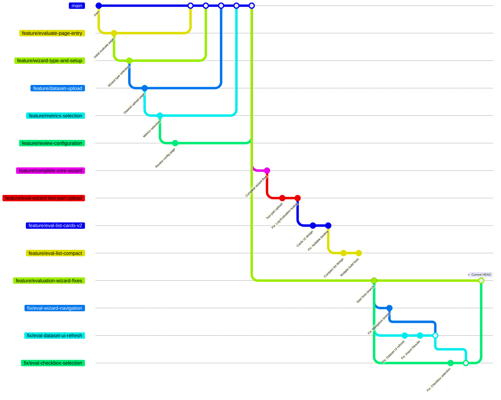

# Complete Git Branch Flow Diagram

## Full Branch Structure



## Actual Branch Timeline

### Phase 1: Initial Wizard Development
These branches were created to build the evaluation wizard feature:

1. **feature/evaluate-page-entry** - Created the main Evaluate page
2. **feature/wizard-type-and-setup** - Added evaluation type selection
3. **feature/dataset-upload** - Built dataset upload functionality
4. **feature/metrics-selection** - Added metrics/criteria selection
5. **feature/review-configuration** - Created review/summary page
6. **feature/complete-core-wizard** - Combined all wizard steps

### Phase 2: Enhancement Branches
These branches added specific improvements:

7. **feature/eval-wizard-two-part-upload** - Added two-part upload for Import Results workflow
8. **feature/eval-list-cards-v2** - Redesigned evaluation list with cards
9. **feature/eval-list-compact** - Created compact list view

### Phase 3: Bug Fix Branches (Current Work)
These are the recent fix branches we've been working on:

10. **feature/evaluation-wizard-fixes** - Main branch for collecting fixes
11. **fix/eval-wizard-navigation** - Fixed navigation timing issue
12. **fix/eval-dataset-ui-refresh** - Fixed dataset UI refresh
13. **fix/eval-checkbox-selection** - Added checkbox selection

## Branch Relationships

```
main
├── Phase 1: Core Wizard Features (merged)
│   ├── feature/evaluate-page-entry
│   ├── feature/wizard-type-and-setup
│   ├── feature/dataset-upload
│   ├── feature/metrics-selection
│   ├── feature/review-configuration
│   └── feature/complete-core-wizard
│
├── Phase 2: Enhancements (various states)
│   ├── feature/eval-wizard-two-part-upload
│   ├── feature/eval-list-cards-v2
│   └── feature/eval-list-compact
│
└── Phase 3: Bug Fixes (current)
    └── feature/evaluation-wizard-fixes
        ├── fix/eval-wizard-navigation (merged)
        ├── fix/eval-dataset-ui-refresh (merged)
        └── fix/eval-checkbox-selection (merged)
```

## Current State Summary

### Active Development Branch
- **feature/evaluation-wizard-fixes** - Contains all recent fixes

### Fix Branches (All merged into feature/evaluation-wizard-fixes)
- **fix/eval-wizard-navigation** - Navigation timing fix ✅
- **fix/eval-dataset-ui-refresh** - Dataset UI refresh fix ✅
- **fix/eval-checkbox-selection** - Checkbox selection ✅

### Other Feature Branches (Still exist but not actively used)
- **feature/complete-core-wizard** - Original complete wizard
- **feature/eval-wizard-two-part-upload** - Two-part upload feature
- **feature/eval-list-cards-v2** - Card-based list view
- **feature/eval-list-compact** - Compact list view

## Branch Status

| Branch | Purpose | Status | Merged |
|--------|---------|--------|--------|
| `feature/evaluate-page-entry` | Initial page | Complete | ✅ |
| `feature/wizard-type-and-setup` | Type selection | Complete | ✅ |
| `feature/dataset-upload` | Dataset upload | Complete | ✅ |
| `feature/metrics-selection` | Metrics page | Complete | ✅ |
| `feature/review-configuration` | Review page | Complete | ✅ |
| `feature/complete-core-wizard` | Combined wizard | Complete | ✅ |
| `feature/eval-wizard-two-part-upload` | Two-part upload | Complete | ? |
| `feature/eval-list-cards-v2` | Card view | Complete | ? |
| `feature/eval-list-compact` | Compact view | Has build errors | ❌ |
| `feature/evaluation-wizard-fixes` | Bug fixes | Active | ⏳ |
| `fix/eval-wizard-navigation` | Navigation fix | Complete | ✅ (into fixes branch) |
| `fix/eval-dataset-ui-refresh` | UI refresh fix | Complete | ✅ (into fixes branch) |
| `fix/eval-checkbox-selection` | Checkbox feature | Complete | ✅ (into fixes branch) |

## Key Insights

1. The project has gone through multiple development phases
2. Many feature branches were created for different parts of the wizard
3. Some branches like `feature/eval-list-compact` had build issues
4. The current `feature/evaluation-wizard-fixes` branch consolidates recent bug fixes
5. All three fix branches have been successfully merged together