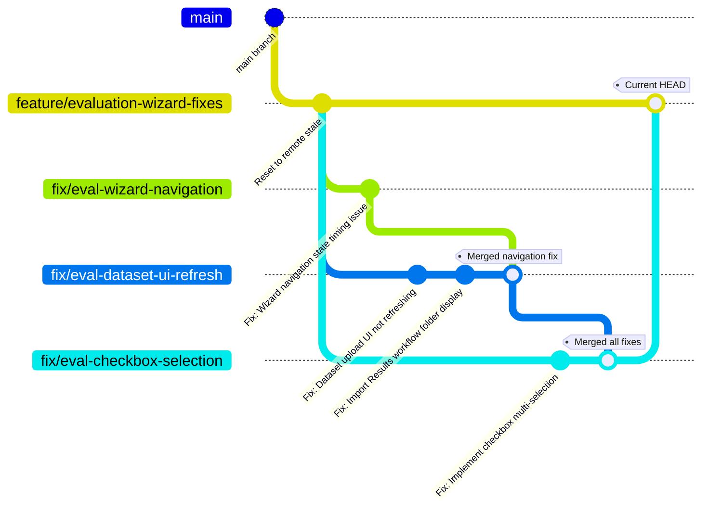

# Git Branch Flow Diagram

## Branch Structure



## Detailed Flow

### 1. Starting Point
```
main
  └── feature/evaluation-wizard-fixes (reset to remote)
```

### 2. First Fix Branch
```
feature/evaluation-wizard-fixes
  └── fix/eval-wizard-navigation
       └── Fixed wizard navigation timing issue
```

### 3. Second Fix Branch
```
feature/evaluation-wizard-fixes
  └── fix/eval-dataset-ui-refresh
       ├── Fixed dataset UI refresh
       └── Fixed Import Results folder display
```

### 4. Merge Navigation into Dataset Branch
```
fix/eval-dataset-ui-refresh
  └── merge: fix/eval-wizard-navigation
       └── Now contains both navigation and dataset fixes
```

### 5. Third Fix Branch
```
feature/evaluation-wizard-fixes
  └── fix/eval-checkbox-selection
       └── Implemented checkbox multi-selection
```

### 6. Final Merge
```
fix/eval-checkbox-selection
  └── merge: fix/eval-dataset-ui-refresh
       └── Now contains all three fixes:
           - Navigation timing fix
           - Dataset UI refresh fix
           - Checkbox selection functionality
```

### 7. Current State
```
feature/evaluation-wizard-fixes (current branch)
  └── Contains all fixes ready for testing
```

## Branch Purposes

| Branch | Purpose | Status |
|--------|---------|--------|
| `main` | Production branch | Stable |
| `feature/evaluation-wizard-fixes` | Feature branch containing all fixes | Active |
| `fix/eval-wizard-navigation` | Fixed navigation timing issue | Merged |
| `fix/eval-dataset-ui-refresh` | Fixed dataset UI refresh | Merged |
| `fix/eval-checkbox-selection` | Added checkbox selection | Merged |

## Commands Used

```bash
# Created first fix branch
git checkout -b fix/eval-wizard-navigation

# Created second fix branch  
git checkout feature/evaluation-wizard-fixes
git checkout -b fix/eval-dataset-ui-refresh

# Merged navigation into dataset branch
git checkout fix/eval-dataset-ui-refresh
git merge fix/eval-wizard-navigation

# Created third fix branch
git checkout feature/evaluation-wizard-fixes  
git checkout -b fix/eval-checkbox-selection

# Final merge of all fixes
git checkout fix/eval-checkbox-selection
git merge fix/eval-dataset-ui-refresh

# The feature branch now has all fixes
```

## Result

All three fixes are now combined in `feature/evaluation-wizard-fixes` branch:
- ✅ Wizard navigation timing issue (Step 3 was being skipped)
- ✅ Dataset UI refresh for Import Results workflow
- ✅ Checkbox multi-selection functionality

Ready for testing and eventual merge to main branch.